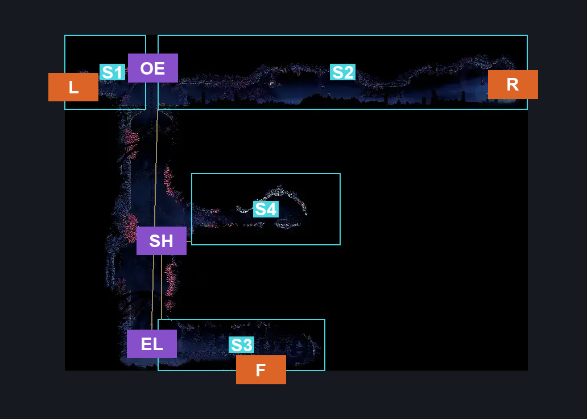
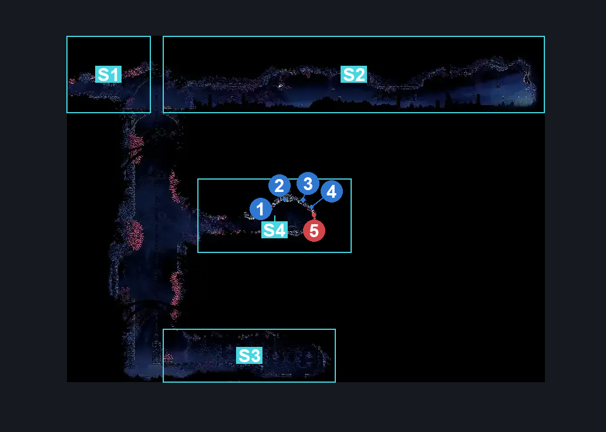
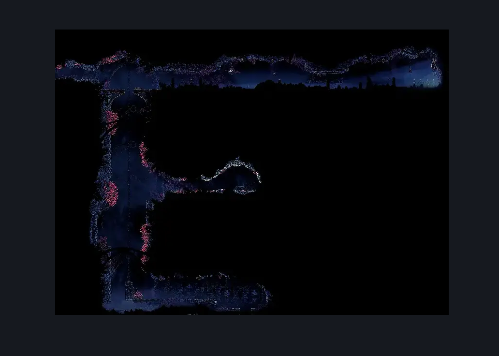

# Sands of Karak Elevator to Blasted Steps (Coral_38)

**Game ID:** Coral_38

**Contributors:** Pyxl

## Subrooms

| No. | Subroom | Annotated |
| --- | --- | --- |
| S1 | Left | ✓ |
| S2 | Right | ✓ |
| S3 | Bottom | ✓ |
| S4 | Shardilard Ledge | ✓ |

## Room Transitions

| Alias | Name | From subroom | Destination | Destination alias | Requirements | TODO | Verification | Annotated | Notes |
| --- | --- | --- | --- | --- | --- | --- | --- | --- | --- |
| L | left1 | Left | [Sands of Karak Right Side Tall room (Coral_26)](sands-of-karak-right-side-tall-room.md) | R | None |  | Verified | ✓ |  |
| R | right1 | Right | [Sands of Karak Bellshrine (Bellshrine_Coral)](sands-of-karak-bellshrine.md) | L | None |  | Verified | ✓ |  |
| F | bot1 | Bottom | [Pre Last Judge Room (Coral_32)](../blasted-steps/pre-last-judge-room.md) | T | None |  | Verified | ✓ |  |

## Subroom Connections

| Alias | Name | Source | Destination | Requirements | TODO | Verification | Annotated | Notes |
| --- | --- | --- | --- | --- | --- | --- | --- | --- |
| OE | Over Elevator | Left | Right | easy Shaman Crest pogo OR Ledge Grab OR Cling Grip OR Sprint OR ( Dash AND Scuttlebrace ) OR Silk Soar OR easy Beast Crest pogo OR Clawline OR Activate Elevator switch Karak OR ( ( easy Reaper Crest pogo OR easy Hunter Crest pogo) AND easy Needle Strike stall ) |  | Verified | ✓ |  |
| OE | Over Elevator | Right | Left | None |  | Verified | ✓ |  |
| EL | Elevator | Right | Bottom | Activate Elevator switch Karak |  | Verified | ✓ |  |
| EL | Elevator | Bottom | Right | Activate Elevator switch Karak |  | Verified | ✓ |  |
| SH | Shaft | Bottom | Shardilard Ledge | Silk Soar OR ( Cling grip AND ( Faydown Cloak OR Drifters Cloak OR Clawline OR Sharpdart OR ( Dash AND ( ( easy Beast Crest pogo OR easy Shaman Crest pogo ) OR ( easy Architect crest pogo AND easy Needle Strike stall ) ) ) OR ( Dash AND Scuttlebrace AND Clawline AND ( Faydown Cloak OR Drifters Cloak ) ) ) ) |  | Verified | ✓ |  |
| SH | Shaft | Shardilard Ledge | Bottom | None |  | Verified | ✓ |  |

## Check Locations

| No. | Check | Subroom | Requirements | TODO | Verification | Location Type | Annotated | Notes |
| --- | --- | --- | --- | --- | --- | --- | --- | --- |
| 1 | Sands of Karak - Shellshard Cache #5 | Shardilard Ledge | None |  | Verified | resource | ✓ |  |
| 2 | Sands of Karak - Shellshard Cache #6 | Shardilard Ledge | None |  | Verified | resource | ✓ |  |
| 3 | Sands of Karak - Shellshard Cache #7 | Shardilard Ledge | None |  | Verified | resource | ✓ |  |
| 4 | Sands of Karak - Shellshard Cache #8 | Shardilard Ledge | None |  | Verified | resource | ✓ |  |
| 5 | Shardilard | Shardilard Ledge | None |  | Verified | enemy | ✓ | Should these be included? |
| 6 | Elevator Switch karak | Right | None |  | Verified | switch |  |  |

## Room Images

### Connections

### Checks

### Scene

