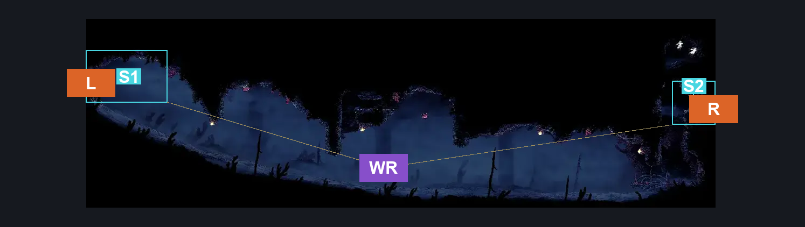
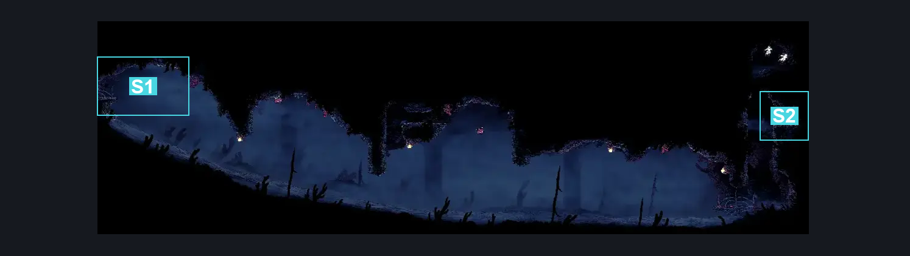
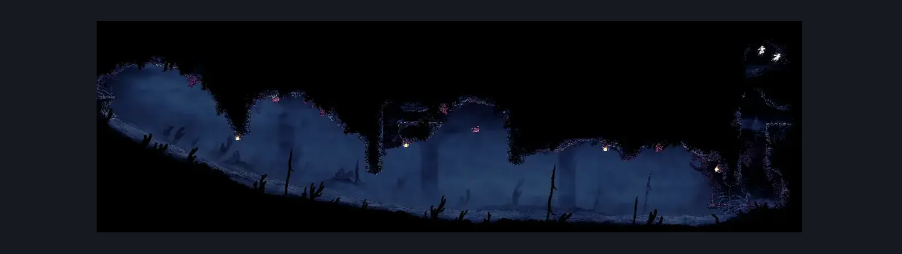

# Sands of Karak Upper Right Long Room (Coral_44)

**Game ID:** Coral_44

**Contributors:** Pyxl

## Subrooms

| No. | Subroom | Annotated |
| --- | --- | --- |
| S1 | Left Exit | ✓ |
| S2 | Right Exit | ✓ |

## Room Transitions

| Alias | Name | From subroom | Destination | Destination alias | Requirements | TODO | Verification | Annotated | Notes |
| --- | --- | --- | --- | --- | --- | --- | --- | --- | --- |
| L | left1 | Left Exit | [Sands of Karak Tall Centre Room (Coral_35b)](sands-of-karak-tall-centre-room.md) | UR | None |  | Verified | ✓ |  |
| R | right1 | Right Exit | [Sands of Karak Right Side Tall room (Coral_26)](sands-of-karak-right-side-tall-room.md) | UL | None |  | Verified | ✓ |  |

## Subroom Connections

| Alias | Name | Source | Destination | Requirements | TODO | Verification | Annotated | Notes |
| --- | --- | --- | --- | --- | --- | --- | --- | --- |
| WR | Whole Room | Left Exit | Right Exit | Cling grip AND ( Clawline OR ( Faydown Cloak AND ( Dash OR Sharpdart OR Drifters Cloak ) ) ) |  | Verified | ✓ |  |
| WR | Whole Room | Right Exit | Left Exit | Clawline AND ( Drifters Cloak OR easy Shaman Crest pogo ) AND ( Cling grip OR Silk Soar ) |  | Verified | ✓ |  |

## Check Locations

No check locations defined.

## Room Images

### Connections

### Checks

### Scene

