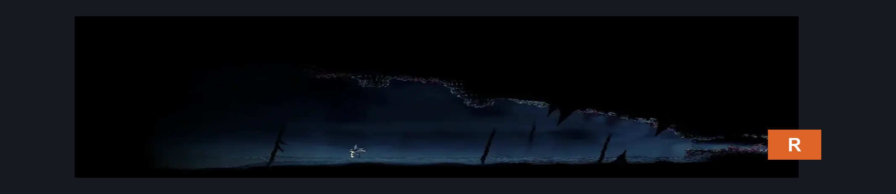
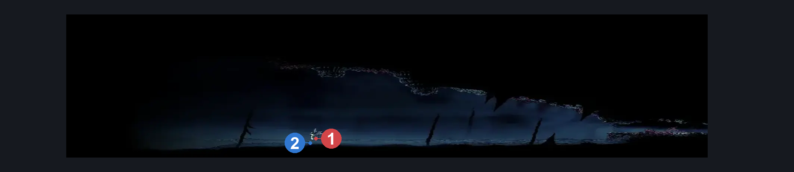
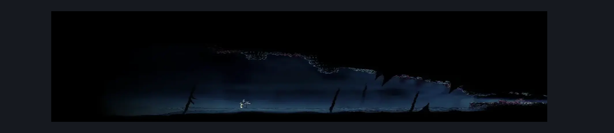

# Watcher at the Edge (Coral_39)

**Game ID:** Coral_39

**Contributors:** Pyxl

## Subrooms

No subrooms defined.

## Room Transitions

| Alias | Name | From subroom | Destination | Destination alias | Requirements | TODO | Verification | Annotated | Notes |
| --- | --- | --- | --- | --- | --- | --- | --- | --- | --- |
| R | right1 |  | [Sands of Karak Lower Left Long Room (Coral_23)](sands-of-karak-lower-left-long-room.md) | UL | None |  | Verified | ✓ |  |

## Subroom Connections

No subroom connections defined.

## Check Locations

| No. | Check | Subroom | Requirements | TODO | Verification | Location Type | Annotated | Notes |
| --- | --- | --- | --- | --- | --- | --- | --- | --- |
| 1 | Watcher at the Edge |  | Needolin |  | Verified | boss | ✓ |  |
| 2 | Grey Memento |  | Needolin |  | Verified | collectible | ✓ |  |
| 3 | import enemies |  |  | TODO | Needs verification |  |  |  |

## Room Images

### Connections

### Checks

### Scene

