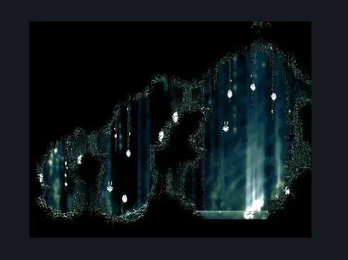
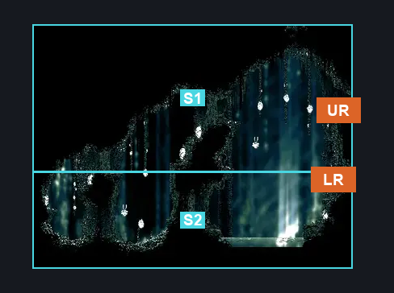
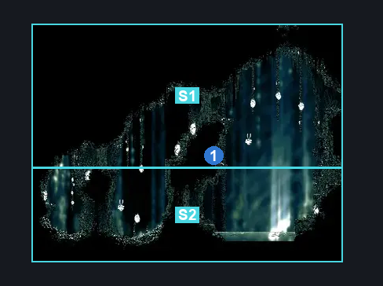

# Cling Grip Side Room (Shellwood_11)

**Game ID:** Shellwood_11

**Contributors:** Pyxl

## Subrooms

| No. | Subroom | Annotated |
| --- | --- | --- |
| S1 | Upper Level | ✓ |
| S2 | Lower Level | ✓ |

## Room Transitions

| Alias | Name | From subroom | Destination | Destination alias | Requirements | TODO | Verification | Annotated | Notes |
| --- | --- | --- | --- | --- | --- | --- | --- | --- | --- |
| LR | right2 | Lower Level | [Cling Grip Room (Shellwood_10)](cling-grip-room.md) | ML | None |  | Verified | ✓ |  |
| UR | right1 | Upper Level | [Cling Grip Room (Shellwood_10)](cling-grip-room.md) | UL | None |  | Verified | ✓ |  |

## Subroom Connections

| Alias | Name | Source | Destination | Requirements | TODO | Verification | Annotated | Notes |
| --- | --- | --- | --- | --- | --- | --- | --- | --- |
| FP | Flower Pogos | Lower Level | Upper Level | ( Easy enemy pogo AND Swim ) OR Dash OR Sprint OR SharpDart OR easy Beast Crest pogo OR Faydown Cloak OR Drifters Cloak OR Clawline OR ( Dash AND Scuttlebrace ) OR Cling Grip OR Silk Soar |  | Verified |  |  |
| FP | Flower Pogos | Upper Level | Lower Level | None |  | Verified |  |  |

## Check Locations

| No. | Check | Subroom | Requirements | TODO | Verification | Location Type | Annotated | Notes |
| --- | --- | --- | --- | --- | --- | --- | --- | --- |
| 1 | Rosary Grave Marker | Upper Level | None |  | Verified | resource | ✓ |  |

## Room Images

### Scene

### Connections

### Checks

