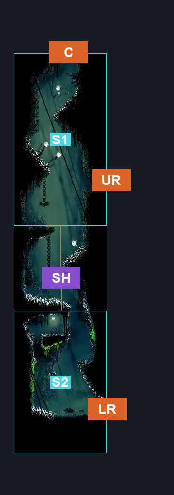
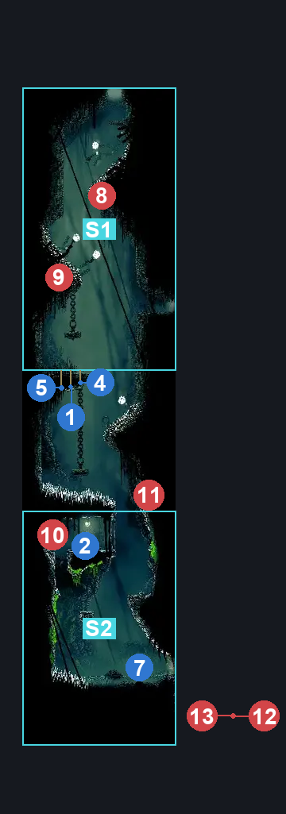
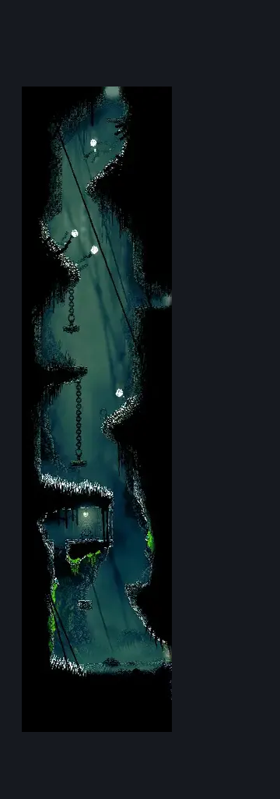

# Greyroots Basement Tall room (Mosstown_03)

**Game ID:** Mosstown_03

**Contributors:** Pyxl

## Subrooms

| No. | Subroom | Annotated |
| --- | --- | --- |
| S1 | Top | ✓ |
| S2 | Bottom | ✓ |

## Room Transitions

| Alias | Name | From subroom | Destination | Destination alias | Requirements | TODO | Verification | Annotated | Notes |
| --- | --- | --- | --- | --- | --- | --- | --- | --- | --- |
| UR | right2 | Top | [Shellwood Diddy Basement Main (Shellwood_25)](shellwood-diddy-basement-main.md) | L | None |  | Verified | ✓ |  |
| LR | right1 | Bottom | [The Marrow Skull Wall (Bone_06)](../the-marrow/the-marrow-skull-wall.md) | L | clear blast rock exit blockade |  | Verified | ✓ |  |
| C | top1 | Top | [Shellwood Lower Left Tall Room (Shellwood_03)](shellwood-lower-left-tall-room.md) | F | Cling Grip |  | Verified | ✓ |  |

## Subroom Connections

| Alias | Name | Source | Destination | Requirements | TODO | Verification | Annotated | Notes |
| --- | --- | --- | --- | --- | --- | --- | --- | --- |
| SH | Shaft | Top | Bottom | None |  | Verified | ✓ |  |
| SH | Shaft | Bottom | Top | Silksoar OR Cling grip |  | Verified | ✓ |  |

## Check Locations

| No. | Check | Subroom | Requirements | TODO | Verification | Location Type | Annotated | Notes |
| --- | --- | --- | --- | --- | --- | --- | --- | --- |
| 1 | Shell Shard Cache: Shellwood #1 | Top | None |  | Verified | resource | ✓ |  |
| 2 | Bench Diddy Basement | Bottom | Cling Grip OR ( Dash AND Scuttlebrace ) |  | Verified | bench | ✓ |  |
| 3 | Craw Summons | Bottom | Craw Summons Ready |  | Verified | collectible |  |  |
| 4 | Shell Shard Cache: Shellwood #2 | Top | None |  | Verified | resource | ✓ |  |
| 5 | Shell Shard Cache: Shellwood #3 | Top | None |  | Verified | resource | ✓ |  |
| 6 | Breakable Roof Diddy Basement | Top | Cling Grip |  | Verified | blockade |  |  |
| 7 | Blast Rock Exit Blockade | Bottom | break blast rock right |  | Verified | blockade | ✓ |  |
| 8 | Shellwood Goomba Flyer (1) 1 |  |  |  |  | enemy | ✓ |  |
| 9 | Shellwood Goomba Flyer 1 |  |  |  |  | enemy | ✓ |  |
| 10 | Aknid 1 |  |  |  |  | enemy | ✓ |  |
| 11 | Aknid 2 |  |  |  |  | enemy | ✓ |  |
| 12 | Shellwood Gnat 1 |  |  |  |  | enemy | ✓ |  |
| 13 | Shellwood Gnat 2 |  |  |  |  | enemy | ✓ |  |

## Room Images

### Connections

### Checks

### Scene

