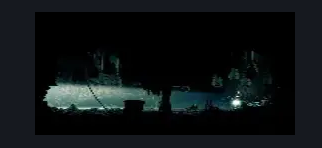
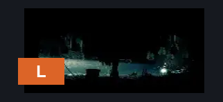
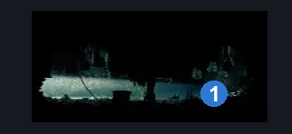

# Long Pin (Belltown_Room_shellwood)

**Game ID:** Belltown_Room_shellwood

**Contributors:** Pyxl

## Subrooms

No subrooms defined.

## Room Transitions

| Alias | Name | From subroom | Destination | Destination alias | Requirements | TODO | Verification | Annotated | Notes |
| --- | --- | --- | --- | --- | --- | --- | --- | --- | --- |
| L | left1 |  | [Shellwood Right Side Big room (Shellwood_01)](shellwood-right-side-big-room.md) | UR | None |  | Verified | ✓ |  |

## Subroom Connections

No subroom connections defined.

## Check Locations

| No. | Check | Subroom | Requirements | TODO | Verification | Location Type | Annotated | Notes |
| --- | --- | --- | --- | --- | --- | --- | --- | --- |
| 1 | Long pin |  | None |  | Verified | collectible | ✓ |  |

## Room Images

### Scene

### Connections

### Checks

