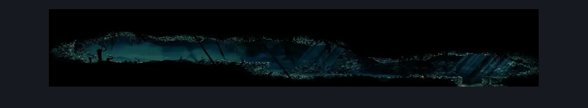
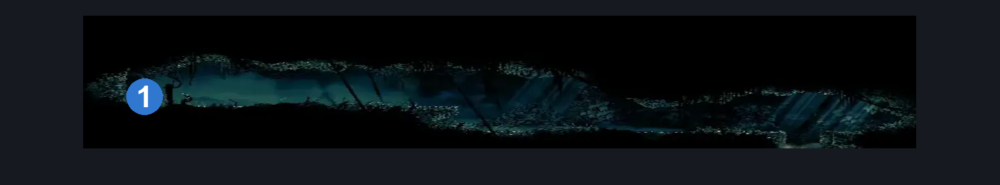

# Shellgrave (Shellgrave)

**Game ID:** Shellgrave

**Contributors:** Pyxl

## Subrooms

No subrooms defined.

## Room Transitions

| Alias | Name | From subroom | Destination | Destination alias | Requirements | TODO | Verification | Annotated | Notes |
| --- | --- | --- | --- | --- | --- | --- | --- | --- | --- |
| F | bot1 |  | [Shellwood Left Side Long Pond Room (Shellwood_04b)](shellwood-left-side-long-pond-room.md) | RC | None |  | Verified | ✓ |  |

## Subroom Connections

No subroom connections defined.

## Check Locations

| No. | Check | Subroom | Requirements | TODO | Verification | Location Type | Annotated | Notes |
| --- | --- | --- | --- | --- | --- | --- | --- | --- |
| 1 | Rosary Cache |  | None |  | Verified | resource | ✓ | Not included no id |

## Room Images

### Scene

### Connections

### Checks

