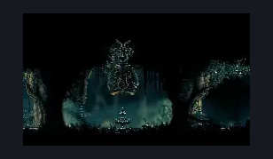
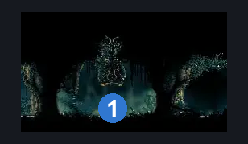

# Shellwood Bellshrine (Bellshrine_03)

**Game ID:** Bellshrine_03

**Contributors:** Pyxl

## Subrooms

No subrooms defined.

## Room Transitions

| Alias | Name | From subroom | Destination | Destination alias | Requirements | TODO | Verification | Annotated | Notes |
| --- | --- | --- | --- | --- | --- | --- | --- | --- | --- |
| L | left1 |  | [Shellwood Connection To Blasted steps (Shellwood_08)](shellwood-connection-to-blasted-steps.md) | R | None |  | Verified | ✓ |  |
| R | right1 |  | [Shellwood Bellway (Shellwood_19)](shellwood-bellway.md) | L | ( bellshrinesanity off AND activate bellshrine switch )  OR ( bellshrinesanity on AND have bell shellwood ) |  | Verified | ✓ | must keep in sync with the other side |

## Subroom Connections

No subroom connections defined.

## Check Locations

| No. | Check | Subroom | Requirements | TODO | Verification | Location Type | Annotated | Notes |
| --- | --- | --- | --- | --- | --- | --- | --- | --- |
| 1 | Bell: Shellwood |  | activate bellshrine switch |  | Verified | collectible | ✓ |  |
| 2 | bench |  | activate bellshrine switch |  | Verified | bench |  |  |
| 3 | bellshrine switch |  | flip switch down |  | Verified | switch |  |  |

## Room Images

### Scene

### Connections

### Checks

