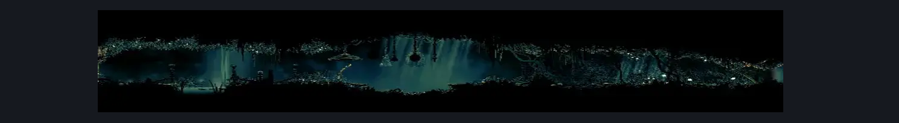

# Shellwood Bellway (Shellwood_19)

**Game ID:** Shellwood_19

**Contributors:** Pyxl

## Subrooms

| No. | Subroom | Annotated |
| --- | --- | --- |
| S1 | Left Puddle | ✓ |
| S2 | Right Puddle | ✓ |

## Room Transitions

| Alias | Name | From subroom | Destination | Destination alias | Requirements | TODO | Verification | Annotated | Notes |
| --- | --- | --- | --- | --- | --- | --- | --- | --- | --- |
| R | right1 | Right Puddle | [Shellwood Lower Left Tall Room (Shellwood_03)](shellwood-lower-left-tall-room.md) | UL | None |  | Verified | ✓ |  |
| L | left1 | Left Puddle | [Shellwood Bellshrine (Bellshrine_03)](shellwood-bellshrine.md) | R | ( bellshrinesanity off AND activate bellshrine switch IN shellwood bellshrine )  OR ( bellshrinesanity on AND have bell shellwood ) |  | Verified | ✓ | Might also need switch from other side, needs testing |
| BB | door_fastTravelExit | Right Puddle | [Bellway Menu](../fast-travel/bellway-menu.md) | SW | Unlock Shellwood Bellway |  | Verified | ✓ |  |

## Subroom Connections

| Alias | Name | Source | Destination | Requirements | TODO | Verification | Annotated | Notes |
| --- | --- | --- | --- | --- | --- | --- | --- | --- |
| PU | Puddle | Left Puddle | Right Puddle | Swim OR Dash OR Sprint OR Clawline OR Sharpdart OR Easy Beast Crest pogo OR Drifters Cloak OR Faydown Cloak |  | Verified |  |  |
| PU | Puddle | Right Puddle | Left Puddle | Swim OR Dash OR Sprint OR Clawline OR Sharpdart OR Easy Beast Crest pogo OR Drifters Cloak OR Faydown Cloak |  | Verified |  |  |

## Check Locations

| No. | Check | Subroom | Requirements | TODO | Verification | Location Type | Annotated | Notes |
| --- | --- | --- | --- | --- | --- | --- | --- | --- |
| 1 | Shellwood Bellway | Right Puddle | Unlock Bellway Rosary Lock |  | Verified | travel |  |  |
| 2 | Bellway Rosary Lock | Right Puddle | Spend 40 Rosaries |  | Verified | lock |  |  |
| 3 | import enemies |  |  | TODO | Needs verification |  |  |  |

## Room Images

### Connections

### Checks

### Scene

