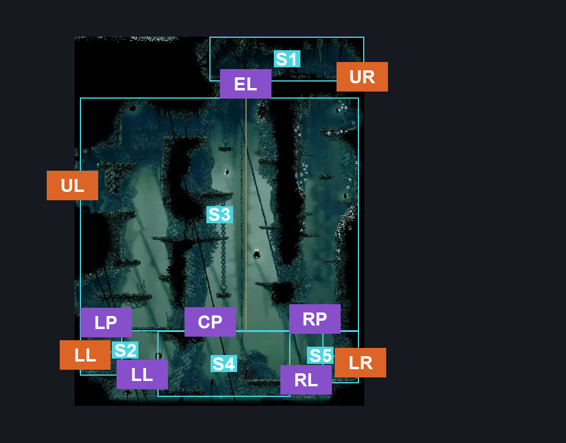
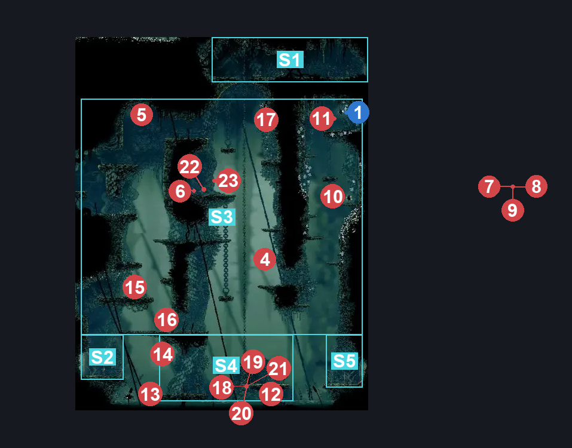
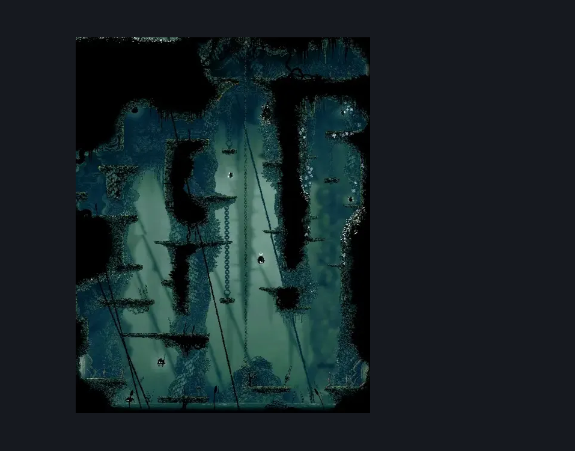

# Shellwood Big Room Left (Shellwood_02)

**Game ID:** Shellwood_02

**Contributors:** Pyxl

## Subrooms

| No. | Subroom | Annotated |
| --- | --- | --- |
| S1 | Ceiling area | ✓ |
| S2 | Ground Left | ✓ |
| S3 | Platforms | ✓ |
| S4 | Ground Centre | ✓ |
| S5 | Ground Right | ✓ |

## Room Transitions

| Alias | Name | From subroom | Destination | Destination alias | Requirements | TODO | Verification | Annotated | Notes |
| --- | --- | --- | --- | --- | --- | --- | --- | --- | --- |
| UR | right1 | Ceiling area | [Shellwood Sister Splinter Bench (Shellwood_01b)](shellwood-sister-splinter-bench.md) | LL | None |  | Verified | ✓ |  |
| LL | left2 | Ground Left | [shellwood Shakra (Shellwood_16)](shellwood-shakra.md) | R | None |  | Verified | ✓ |  |
| UL | left3 | Platforms | [Shellwood Greyroot Entrance (Shellwood_Witch)](shellwood-greyroot-entrance.md) | R | None |  | Verified | ✓ |  |
| LR | right2 | Ground Right | [Shellwood Right Side Big room (Shellwood_01)](shellwood-right-side-big-room.md) | LL | NOne |  | Verified | ✓ |  |

## Subroom Connections

| Alias | Name | Source | Destination | Requirements | TODO | Verification | Annotated | Notes |
| --- | --- | --- | --- | --- | --- | --- | --- | --- |
| EL | Elevator | Ground Centre | Ceiling area | Prereq Elevator Button |  | Verified | ✓ |  |
| EL | Elevator | Ceiling area | Ground Centre | Prereq Elevator Button |  | Verified | ✓ |  |
| RL | Right Lake | Ground Centre | Ground Right | ( Enemy Pogo AND Ledge Grab ) OR Dash OR Sprint OR clawline OR Easy Beast Crest Pogo OR Faydown Cloak OR Drifters Cloak OR ( Swim AND Ledge Grab ) |  | Verified | ✓ |  |
| RL | Right Lake | Ground Right | Ground Centre | ( Enemy Pogo AND Ledge Grab ) OR Dash OR Sprint OR clawline OR Easy Beast Crest Pogo OR Faydown Cloak OR Drifters Cloak OR ( Swim AND Ledge Grab ) |  | Verified | ✓ |  |
| LL | Left Lake | Ground Centre | Ground Left | ( Enemy Pogo AND Ledge Grab ) OR Dash OR Sprint OR clawline OR Easy Beast Crest Pogo OR Faydown Cloak OR Drifters Cloak |  | Verified | ✓ |  |
| LL | Left Lake | Ground Left | Ground Centre | None |  | Verified | ✓ |  |
| LP | Left Platforms | Platforms | Ground Left | None |  | Verified | ✓ |  |
| LP | Left Platforms | Ground Left | Platforms | ( Faydown Cloak AND ( Cling Grip OR ( ScuttleBrace AND Dash ) ) ) OR Silk Soar OR ( Hard Enemy Pogo ) |  | Verified | ✓ |  |
| CP | Central Platforms | Platforms | Ground Centre | None |  | Verified | ✓ |  |
| CP | Central Platforms | Ground Centre | Platforms | ( Faydown Cloak AND Ledge Grab ) OR Silk Soar |  | Verified | ✓ |  |
| RP | Right Platforms | Platforms | Ground Right | None |  | Verified | ✓ |  |
| RP | Right Platforms | Ground Right | Platforms | Silk Soar |  | Verified | ✓ |  |

## Check Locations

| No. | Check | Subroom | Requirements | TODO | Verification | Location Type | Annotated | Notes |
| --- | --- | --- | --- | --- | --- | --- | --- | --- |
| 1 | Pollip Heart #6 | Platforms | Ledge Grab OR Silk Soar OR Faydown Cloak |  | Verified | collectible | ✓ |  |
| 2 | Elevator Button | Ceiling area | None |  | Verified | switch |  |  |
| 3 | Big Door Button | Ground Right | None |  | Verified | switch |  |  |
| 4 | Shellwood Goomba Flyer (3) 1 |  |  |  |  | enemy | ✓ |  |
| 5 | Shellwood Goomba Flyer 1 |  |  |  |  | enemy | ✓ |  |
| 6 | Control 1 |  |  |  |  | enemy | ✓ |  |
| 7 | Wood Wasp 1 |  |  |  |  | enemy | ✓ |  |
| 8 | Wood Wasp 2 |  |  |  |  | enemy | ✓ |  |
| 9 | Wood Wasp 3 |  |  |  |  | enemy | ✓ |  |
| 10 | Wood Wasp 4 |  |  |  |  | enemy | ✓ |  |
| 11 | Wood Wasp 5 |  |  |  |  | enemy | ✓ |  |
| 12 | Pond Skipper 1 |  |  |  |  | enemy | ✓ |  |
| 13 | Pond Skipper 2 |  |  |  |  | enemy | ✓ |  |
| 14 | Pondcatcher 1 |  |  |  |  | enemy | ✓ |  |
| 15 | Splinter 1 |  |  |  |  | enemy | ✓ |  |
| 16 | Splinterhorn 1 |  |  |  |  | enemy | ✓ |  |
| 17 | Void Mass 1 |  | Black Thread World Spawn |  |  | enemy | ✓ |  |
| 18 | Shellwood Gnat 1 |  |  |  |  | enemy | ✓ |  |
| 19 | Shellwood Gnat 2 |  |  |  |  | enemy | ✓ |  |
| 20 | Shellwood Gnat 3 |  |  |  |  | enemy | ✓ |  |
| 21 | Shellwood Gnat 4 |  |  |  |  | enemy | ✓ |  |
| 22 | Wood Wasp 6 |  |  |  |  | enemy | ✓ |  |
| 23 | Wood Wasp 7 |  |  |  |  | enemy | ✓ |  |

## Room Images

### Connections

### Checks

### Scene

