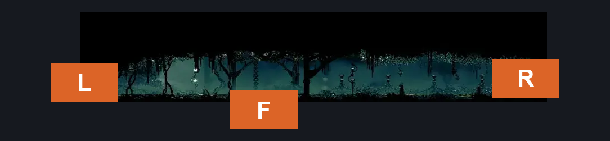
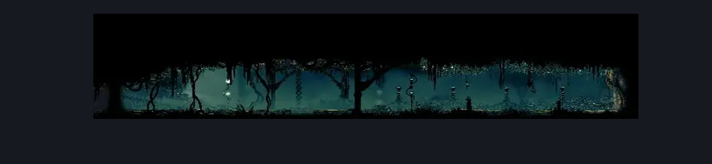

# Shellwood Connection To Blasted steps (Shellwood_08)

**Game ID:** Shellwood_08

**Contributors:** Pyxl

## Subrooms

No subrooms defined.

## Room Transitions

| Alias | Name | From subroom | Destination | Destination alias | Requirements | TODO | Verification | Annotated | Notes |
| --- | --- | --- | --- | --- | --- | --- | --- | --- | --- |
| R | right1 |  | [Shellwood Bellshrine (Bellshrine_03)](shellwood-bellshrine.md) | L | None |  | Verified | ✓ |  |
| L | left1 |  | [Blasted Steps Map Edge (Coral_19)](../blasted-steps/blasted-steps-map-edge.md) | R | None |  | Verified | ✓ |  |
| F | bot1 |  | [shellwood Far Left Tall Room (Shellwood_04c)](shellwood-far-left-tall-room.md) | C | None |  | Verified | ✓ |  |

## Subroom Connections

No subroom connections defined.

## Check Locations

No check locations defined.

## Room Images

### Connections

### Checks

### Scene

