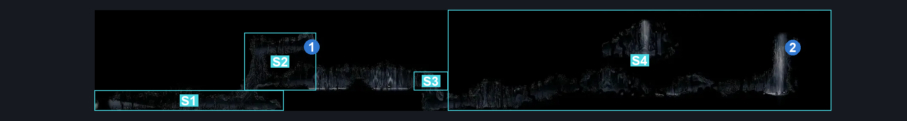
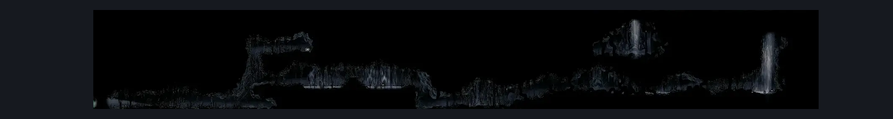

# Shellwood Diddy Basement Main (Shellwood_25)

**Game ID:** Shellwood_25

**Contributors:** Pyxl

## Subrooms

| No. | Subroom | Annotated |
| --- | --- | --- |
| S1 | Left Corridor | ✓ |
| S2 | Left Puddles | ✓ |
| S3 | Right Puddles | ✓ |
| S4 | Right Corridor | ✓ |

## Room Transitions

| Alias | Name | From subroom | Destination | Destination alias | Requirements | TODO | Verification | Annotated | Notes |
| --- | --- | --- | --- | --- | --- | --- | --- | --- | --- |
| L | left1 | Left Corridor | [Greyroots Basement Tall room (Mosstown_03)](greyroots-basement-tall-room.md) | UR | None |  | Verified | ✓ |  |
| D | door1 | Right Corridor | [Witch Chapel (Shellwood_25b)](witch-chapel.md) | L | INVALID |  | Verified | ✓ |  |

## Subroom Connections

| Alias | Name | Source | Destination | Requirements | TODO | Verification | Annotated | Notes |
| --- | --- | --- | --- | --- | --- | --- | --- | --- |
| LW | Left Wall | Left Corridor | Left Puddles | Cling Grip OR Silk soar OR Faydown Cloak OR ( Dash AND Scuttlebrace ) |  | Verified | ✓ |  |
| LW | Left Wall | Left Puddles | Left Corridor | None |  | Verified | ✓ |  |
| PU | Puddles | Left Puddles | Right Puddles | Swim OR Clawline OR Sharpdart OR Drifters Cloak OR Easy Enemy Pogo |  | Verified | ✓ |  |
| PU | Puddles | Right Puddles | Left Puddles | Swim OR Clawline OR Sharpdart OR Drifters Cloak OR Easy Enemy Pogo |  | Verified | ✓ |  |
| RW | Right Wall | Right Puddles | Right Corridor | Cling Grip OR Silk soar OR Faydown Cloak OR ( Dash AND Scuttlebrace ) |  | Verified | ✓ |  |
| RW | Right Wall | Right Corridor | Right Puddles | None |  | Verified | ✓ |  |

## Check Locations

| No. | Check | Subroom | Requirements | TODO | Verification | Location Type | Annotated | Notes |
| --- | --- | --- | --- | --- | --- | --- | --- | --- |
| 1 | Rosary String: Shellwood #2 | Left Puddles | Cling Grip OR Silk Soar OR ( Faydown Cloak AND Easy Shaman Crest pogo ) OR ( Dash AND Scuttlebrace ) |  | Verified | collectible | ✓ |  |
| 2 | Relic: Weaver effigy (Keelal, Shellwood) | Right Corridor | Cling Grip AND Swim AND ( Clawline OR Faydown Cloak OR Drifters Cloak OR Sharpdart OR Easy Beast Crest pogo OR Sprint OR Dash ) |  | Verified | collectible | ✓ |  |

## Room Images

### Connections

### Checks

### Scene

