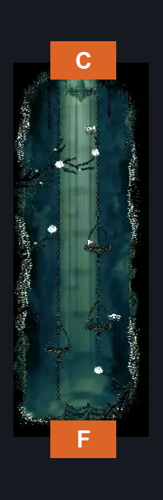
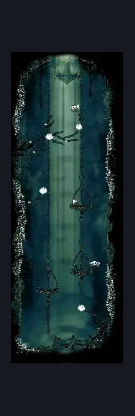

# shellwood Far Left Tall Room (Shellwood_04c)

**Game ID:** Shellwood_04c

**Contributors:** Pyxl

## Subrooms

No subrooms defined.

## Room Transitions

| Alias | Name | From subroom | Destination | Destination alias | Requirements | TODO | Verification | Annotated | Notes |
| --- | --- | --- | --- | --- | --- | --- | --- | --- | --- |
| C | top1 |  | [Shellwood Connection To Blasted steps (Shellwood_08)](shellwood-connection-to-blasted-steps.md) | F | ( Faydown Cloak AND Hard enemy pogo ) OR cling grip OR silk soar OR ( Dash AND Medium Scuttlebrace AND Faydown Cloak ) |  | Verified | ✓ |  |
| F | bot1 |  | [Shellwood Left Side Long Pond Room (Shellwood_04b)](shellwood-left-side-long-pond-room.md) | LC | None |  | Verified | ✓ |  |

## Subroom Connections

No subroom connections defined.

## Check Locations

| No. | Check | Subroom | Requirements | TODO | Verification | Location Type | Annotated | Notes |
| --- | --- | --- | --- | --- | --- | --- | --- | --- |
| 1 | import enemies |  |  | TODO | Needs verification |  |  |  |

## Room Images

### Connections

### Checks

### Scene

