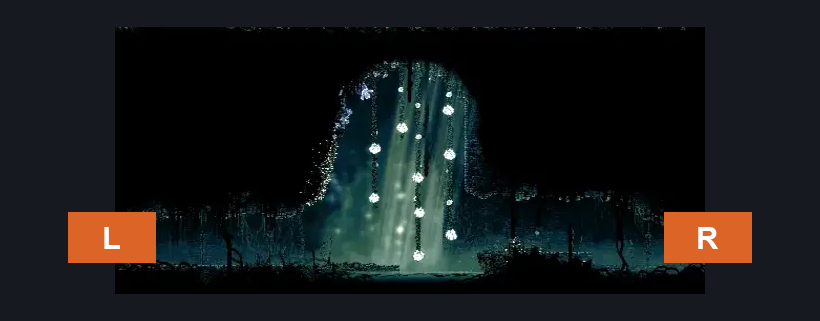
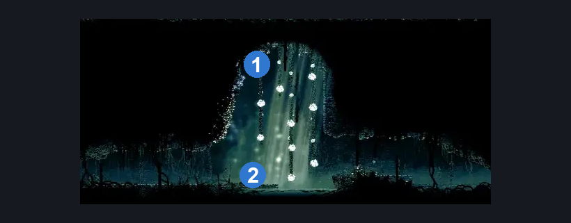
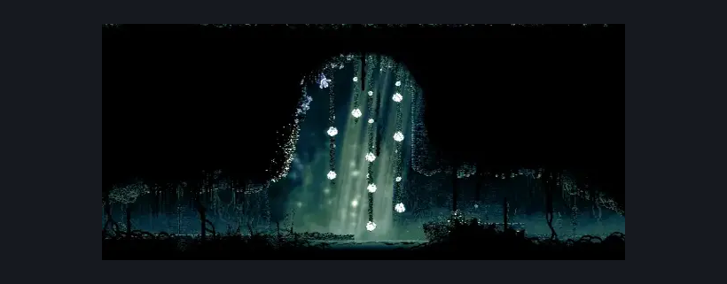

# Shellwood Flower Pogo Upper Hall (Shellwood_20)

**Game ID:** Shellwood_20

**Contributors:** Pyxl

## Subrooms

No subrooms defined.

## Room Transitions

| Alias | Name | From subroom | Destination | Destination alias | Requirements | TODO | Verification | Annotated | Notes |
| --- | --- | --- | --- | --- | --- | --- | --- | --- | --- |
| R | right1 |  | [Shellwood Sister Splinter Bench (Shellwood_01b)](shellwood-sister-splinter-bench.md) | UL | None |  | Verified | ✓ |  |
| L | left1 |  | [Cling Grip Room (Shellwood_10)](cling-grip-room.md) | LR | None |  | Verified | ✓ |  |

## Subroom Connections

No subroom connections defined.

## Check Locations

| No. | Check | Subroom | Requirements | TODO | Verification | Location Type | Annotated | Notes |
| --- | --- | --- | --- | --- | --- | --- | --- | --- |
| 1 | Pollip Heart #3 |  | None |  | Verified | collectible | ✓ |  |
| 2 | Seth Meeting Shellwood |  | after THE Seth Meeting Greymoor |  | Verified | event | ✓ |  |

## Room Images

### Connections

### Checks

### Scene

