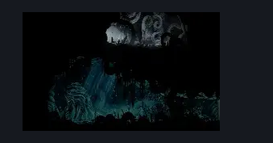

# Shellwood Greyroot Entrance (Shellwood_Witch)

**Game ID:** Shellwood_Witch

**Contributors:** Pyxl

## Subrooms

No subrooms defined.

## Room Transitions

| Alias | Name | From subroom | Destination | Destination alias | Requirements | TODO | Verification | Annotated | Notes |
| --- | --- | --- | --- | --- | --- | --- | --- | --- | --- |
| D | door1 |  | [Greyroot (Room_Witch)](greyroot.md) | L | None |  | Verified | ✓ |  |
| R | right1 |  | [Shellwood Big Room Left (Shellwood_02)](shellwood-big-room-left.md) | UL | None |  | Verified | ✓ |  |

## Subroom Connections

No subroom connections defined.

## Check Locations

No check locations defined.

## Room Images

### Connections

### Checks

### Scene

