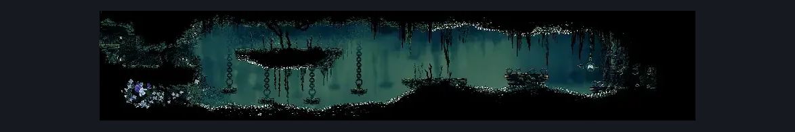
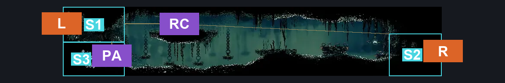
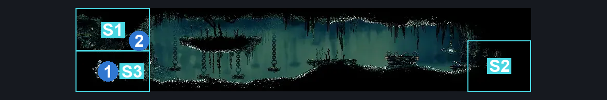

# Shellwood Hidden Bellhart Connection (Shellwood_15)

**Game ID:** Shellwood_15

**Contributors:** Pyxl

## Subrooms

| No. | Subroom | Annotated |
| --- | --- | --- |
| S1 | Left Exit Area | ✓ |
| S2 | Right Exit Area | ✓ |
| S3 | Pollip Spot | ✓ |

## Room Transitions

| Alias | Name | From subroom | Destination | Destination alias | Requirements | TODO | Verification | Annotated | Notes |
| --- | --- | --- | --- | --- | --- | --- | --- | --- | --- |
| L | left1 | Left Exit Area | [Shellwood Sister Splinter Bench (Shellwood_01b)](shellwood-sister-splinter-bench.md) | MR | Clear Shellwood 15 Wall |  | Verified | ✓ |  |
| R | right1 | Right Exit Area | [Upper Bellhart (Belltown_04)](../bellhart/upper-bellhart.md) | LL | None |  | Verified | ✓ |  |

## Subroom Connections

| Alias | Name | Source | Destination | Requirements | TODO | Verification | Annotated | Notes |
| --- | --- | --- | --- | --- | --- | --- | --- | --- |
| RC | Room Crossing | Left Exit Area | Right Exit Area | Faydown Cloak OR Drifters Cloak OR Dash OR Clawline OR Sharpdart OR easy Beast Crest pogo |  | Verified | ✓ |  |
| RC | Room Crossing | Right Exit Area | Left Exit Area | Faydown Cloak OR ( Drifters Cloak AND Ledge Grab ) OR ( Dash AND Ledge Grab )  OR Clawline OR Sharpdart OR easy Beast Crest pogo |  | Verified | ✓ |  |
| PA | Pollip Access | Left Exit Area | Pollip Spot | Break Wall Left |  | Verified | ✓ |  |
| PA | Pollip Access | Pollip Spot | Left Exit Area | Break Wall Right |  | Verified | ✓ |  |

## Check Locations

| No. | Check | Subroom | Requirements | TODO | Verification | Location Type | Annotated | Notes |
| --- | --- | --- | --- | --- | --- | --- | --- | --- |
| 1 | Pollip Heart #2 | Pollip Spot | Faydown Cloak OR Drifters Cloak OR Dash OR Clawline OR Sharpdart OR easy Beast Crest pogo |  | Verified | collectible | ✓ |  |
| 2 | Shellwood 15 Wall | Left Exit Area | Break Wall Left |  | Verified | blockade | ✓ |  |

## Room Images

### Scene

### Connections

### Checks

