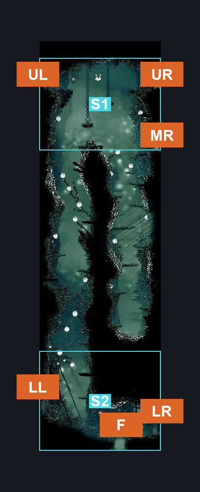
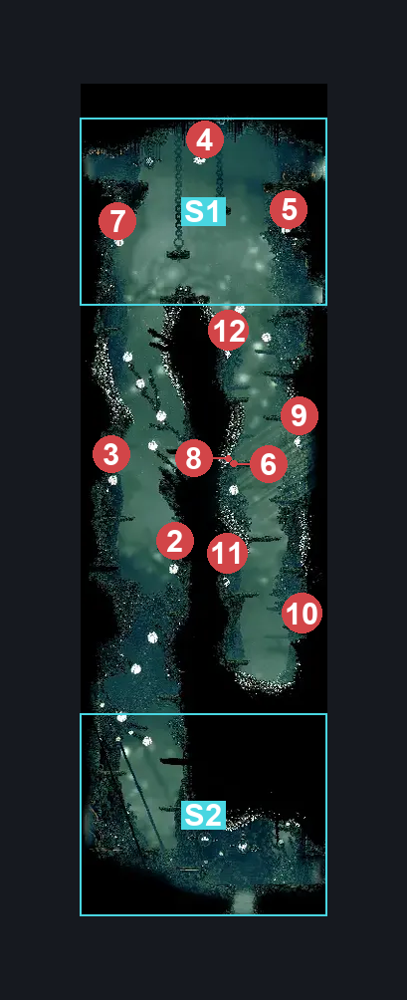
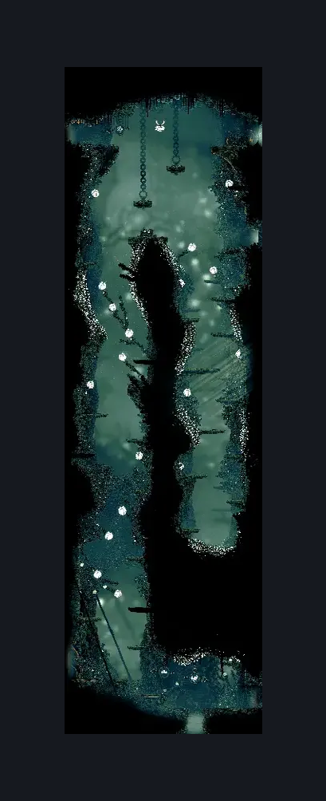

# Shellwood Lower Left Tall Room (Shellwood_03)

**Game ID:** Shellwood_03

**Contributors:** Pyxl

## Subrooms

| No. | Subroom | Annotated |
| --- | --- | --- |
| S1 | Top | ✓ |
| S2 | Bottom | ✓ |

## Room Transitions

| Alias | Name | From subroom | Destination | Destination alias | Requirements | TODO | Verification | Annotated | Notes |
| --- | --- | --- | --- | --- | --- | --- | --- | --- | --- |
| UL | left1 | Top | [Shellwood Bellway (Shellwood_19)](shellwood-bellway.md) | R | Sprint OR Dash OR clawline OR silksoar OR Sharpdart OR Drifters Cloak OR Faydown Cloak OR Easy Beast Crest Pogo |  | Verified | ✓ |  |
| F | bot1 | Bottom | [Greyroots Basement Tall room (Mosstown_03)](greyroots-basement-tall-room.md) | C | Clear Breakable Roof Diddy Basement IN Shellwood Diddy Basement Tall room |  | Verified | ✓ | Help |
| MR | right2 | Top | [Shellwood Mask Shard Room (Shellwood_14)](shellwood-mask-shard-room.md) | L | None |  | Verified | ✓ |  |
| LL | left3 | Bottom | [Shellwood Left Side Long Pond Room (Shellwood_04b)](shellwood-left-side-long-pond-room.md) | R | None |  | Verified | ✓ |  |
| UR | right1 | Top | [Cling Grip Room (Shellwood_10)](cling-grip-room.md) | LL | Ledge Grab OR Faydown Cloak OR Silk Soar OR Cling Grip |  | Verified | ✓ |  |
| LR | right3 | Bottom | [shellwood Shakra (Shellwood_16)](shellwood-shakra.md) | L | None |  | Verified | ✓ |  |

## Subroom Connections

| Alias | Name | Source | Destination | Requirements | TODO | Verification | Annotated | Notes |
| --- | --- | --- | --- | --- | --- | --- | --- | --- |
| FP | Flower Pogo | Bottom | Top | Ledge Grab OR Cling Grip OR Silk Soar |  | Verified |  |  |
| FP | Flower Pogo | Top | Bottom | None |  | Verified |  |  |

## Check Locations

| No. | Check | Subroom | Requirements | TODO | Verification | Location Type | Annotated | Notes |
| --- | --- | --- | --- | --- | --- | --- | --- | --- |
| 1 | Flea: Shellwood | Top | None |  | Verified | collectible |  |  |
| 2 | Phacia 1 |  |  |  |  | enemy | ✓ |  |
| 3 | Phacia 2 |  |  |  |  | enemy | ✓ |  |
| 4 | Phacia 3 |  |  |  |  | enemy | ✓ |  |
| 5 | Phacia 4 |  |  |  |  | enemy | ✓ |  |
| 6 | Phacia 5 |  |  |  |  | enemy | ✓ |  |
| 7 | Phacia 6 |  |  |  |  | enemy | ✓ |  |
| 8 | Pollenica 1 |  |  |  |  | enemy | ✓ |  |
| 9 | Pollenica 2 |  |  |  |  | enemy | ✓ |  |
| 10 | Pollenica 3 |  |  |  |  | enemy | ✓ |  |
| 11 | Pollenica 4 |  |  |  |  | enemy | ✓ |  |
| 12 | Pollenica 5 |  |  |  |  | enemy | ✓ |  |

## Room Images

### Connections

### Checks

### Scene

