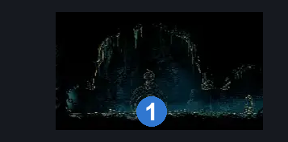
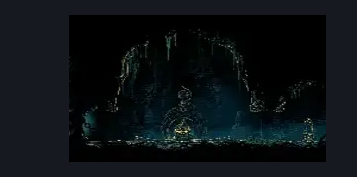

# Shellwood Lower Toll bench (Shellwood_08c)

**Game ID:** Shellwood_08c

**Contributors:** Pyxl

## Subrooms

No subrooms defined.

## Room Transitions

| Alias | Name | From subroom | Destination | Destination alias | Requirements | TODO | Verification | Annotated | Notes |
| --- | --- | --- | --- | --- | --- | --- | --- | --- | --- |
| L | left1 |  | [The Big Fall (Aspid_01)](../bone-bottom/the-big-fall.md) | UR | None |  | Verified | ✓ |  |
| R | right1 |  | [Shellwood Left Side Long Pond Room (Shellwood_04b)](shellwood-left-side-long-pond-room.md) | L | Break Vines Right |  | Verified | ✓ |  |

## Subroom Connections

No subroom connections defined.

## Check Locations

| No. | Check | Subroom | Requirements | TODO | Verification | Location Type | Annotated | Notes |
| --- | --- | --- | --- | --- | --- | --- | --- | --- |
| 1 | Lower Shellwood Toll Bench |  | None |  | Verified | bench | ✓ |  |
| 2 | Craw Summons |  | Craw Summons Ready |  | Verified | collectible |  |  |

## Room Images

### Connections

### Checks

### Scene

