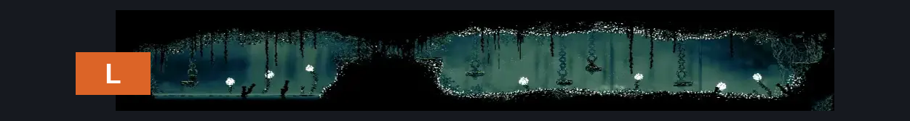
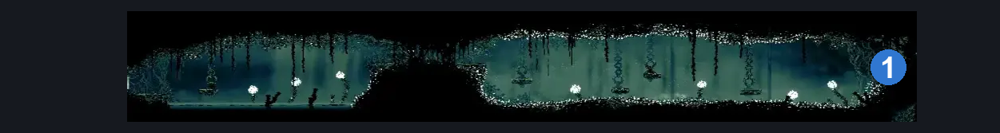
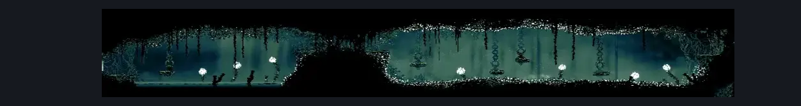

# Shellwood Mask Shard Room (Shellwood_14)

**Game ID:** Shellwood_14

**Contributors:** Pyxl

## Subrooms

No subrooms defined.

## Room Transitions

| Alias | Name | From subroom | Destination | Destination alias | Requirements | TODO | Verification | Annotated | Notes |
| --- | --- | --- | --- | --- | --- | --- | --- | --- | --- |
| L | left1 |  | [Shellwood Lower Left Tall Room (Shellwood_03)](shellwood-lower-left-tall-room.md) | MR | None |  | Verified | ✓ |  |

## Subroom Connections

No subroom connections defined.

## Check Locations

| No. | Check | Subroom | Requirements | TODO | Verification | Location Type | Annotated | Notes |
| --- | --- | --- | --- | --- | --- | --- | --- | --- |
| 1 | Mask Shard: Shellwood #12 |  | Ledge Grab OR Dash OR Clawline OR Faydown Cloak OR Drifters Cloak OR Easy Beast Crest pogo |  | Verified | collectible | ✓ |  |

## Room Images

### Connections

### Checks

### Scene

