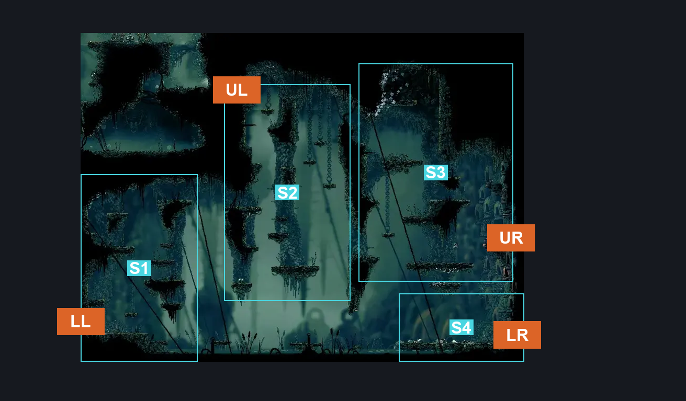
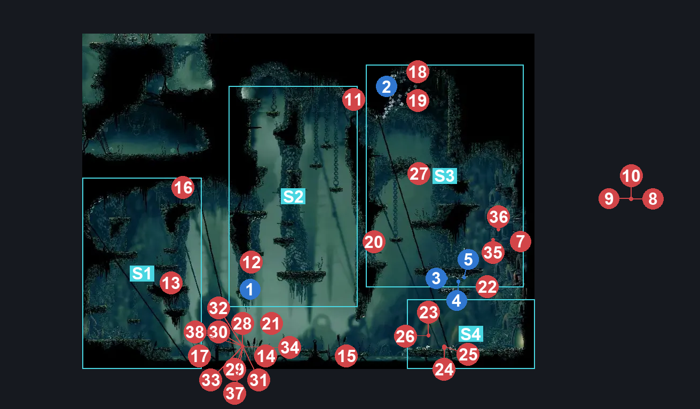
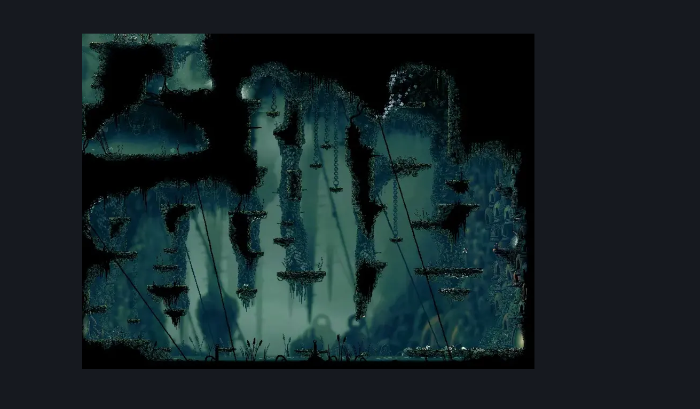

# Shellwood Right Side Big room (Shellwood_01)

**Game ID:** Shellwood_01

**Contributors:** Pyxl

## Subrooms

| No. | Subroom | Annotated |
| --- | --- | --- |
| S1 | Ground Level Left | ✓ |
| S2 | Central Platforms | ✓ |
| S3 | Right Platforms | ✓ |
| S4 | Ground Level Right | ✓ |

## Room Transitions

| Alias | Name | From subroom | Destination | Destination alias | Requirements | TODO | Verification | Annotated | Notes |
| --- | --- | --- | --- | --- | --- | --- | --- | --- | --- |
| UR | right1 | Right Platforms | [Long Pin (Belltown_Room_shellwood)](long-pin.md) | L | Prereq Longpin Nest |  | Verified | ✓ |  |
| UL | left1 | Central Platforms | [Shellwood Sister Splinter Bench (Shellwood_01b)](shellwood-sister-splinter-bench.md) | LR | None |  | Verified | ✓ |  |
| LR | right2 | Ground Level Right | [Bellhart Hallway to Shellwood (Belltown_07)](../bellhart/bellhart-hallway-to-shellwood.md) | L | None |  | Verified | ✓ |  |
| LL | left2 | Ground Level Left | [Shellwood Big Room Left (Shellwood_02)](shellwood-big-room-left.md) | LR | Prereq Big Door Button IN Shellwood Big Room Left |  | Verified | ✓ |  |

## Subroom Connections

| Alias | Name | Source | Destination | Requirements | TODO | Verification | Annotated | Notes |
| --- | --- | --- | --- | --- | --- | --- | --- | --- |
| LA | Lake | Ground Level Left | Ground Level Right | ( Dash AND ( Sprint OR Drifters Cloak ) ) OR Clawline OR Sharpdart OR Swim OR ( Faydown Cloak AND Drifters Cloak ) |  | Verified |  |  |
| LA | Lake | Ground Level Right | Ground Level Left | ( Dash AND ( Sprint OR Drifters Cloak ) ) OR Clawline OR Sharpdart OR Swim OR ( Faydown Cloak AND Drifters Cloak ) |  | Verified |  |  |
| C1 | Chasm 1 | Ground Level Left | Central Platforms | ( Ledge Grab AND ( Dash OR Drifters Cloak OR Easy Beast Crest pogo ) ) OR Clawline OR Cling Grip OR Silk Soar OR Sharpdart OR Faydown Cloak |  | Verified |  |  |
| C1 | Chasm 1 | Central Platforms | Ground Level Left | None |  | Verified |  |  |
| C2 | Chasm 2 | Central Platforms | Right Platforms | Ledge Grab OR Faydown Cloak OR Silk Soar OR Cling grip OR Dash OR Scuttlebrace OR Clawline  OR Sprint |  | Verified |  |  |
| C2 | Chasm 2 | Right Platforms | Central Platforms | None |  | Verified |  |  |
| C3 | Chasm 3 | Right Platforms | Ground Level Right | None |  | Verified |  |  |
| C3 | Chasm 3 | Ground Level Right | Right Platforms | Silk Soar OR ( Cling Grip AND Faydown Cloak  AND ( Swim OR ( Easy Enemy Pogo AND ( Sprint OR Dash ) ) OR Drifters Cloak OR Clawline OR Sharpdart ) ) |  | Verified |  |  |

## Check Locations

| No. | Check | Subroom | Requirements | TODO | Verification | Location Type | Annotated | Notes |
| --- | --- | --- | --- | --- | --- | --- | --- | --- |
| 1 | Shellwood - Frayed Rosary String | Central Platforms | None |  | Verified | collectible | ✓ |  |
| 2 | Pollip Heart #1 | Right Platforms | Cling Grip OR Silk Soar OR Scuttlebrace |  | Verified | collectible | ✓ |  |
| 3 | Shell shard Cache: Shellwood #4 | Right Platforms | None |  | Verified | resource | ✓ |  |
| 4 | Shell shard Cache: Shellwood #5 | Right Platforms | None |  | Verified | resource | ✓ |  |
| 5 | Shell shard Cache: Shellwood #6 | Right Platforms | None |  | Verified | resource | ✓ |  |
| 6 | Longpin Nest | Right Platforms | None |  | Verified | blockade |  |  |
| 7 | Control 1 |  | Normal World Spawn |  |  | enemy | ✓ |  |
| 8 | Wood Wasp 1 |  | Normal World Spawn |  |  | enemy | ✓ |  |
| 9 | Wood Wasp 2 |  | Normal World Spawn |  |  | enemy | ✓ |  |
| 10 | Wood Wasp 3 |  | Normal World Spawn |  |  | enemy | ✓ |  |
| 11 | Shellwood Goomba Flyer (2) 1 |  |  |  |  | enemy | ✓ |  |
| 12 | Shellwood Goomba Flyer (1) 1 |  |  |  |  | enemy | ✓ |  |
| 13 | Shellwood Goomba 1 |  |  |  |  | enemy | ✓ |  |
| 14 | Pond Skipper 1 |  |  |  |  | enemy | ✓ |  |
| 15 | Pond Skipper 2 |  |  |  |  | enemy | ✓ |  |
| 16 | Shellwood Goomba (2) 1 |  |  |  |  | enemy | ✓ |  |
| 17 | Pond Skipper 3 |  |  |  |  | enemy | ✓ |  |
| 18 | Wood Wasp 4 |  |  |  |  | enemy | ✓ |  |
| 19 | Wood Wasp 5 |  |  |  |  | enemy | ✓ |  |
| 20 | Shellwood Goomba Flyer 1 |  | Normal World Spawn |  |  | enemy | ✓ |  |
| 21 | Pondcatcher 1 |  | Normal World Spawn |  |  | enemy | ✓ |  |
| 22 | Shellwood Goomba (6) 1 |  | Normal World Spawn |  |  | enemy | ✓ |  |
| 23 | Pondcatcher 2 |  | Black Thread World Spawn |  |  | enemy | ✓ |  |
| 24 | Pilgrim Hornfly 1 |  | Black Thread World Spawn |  |  | enemy | ✓ |  |
| 25 | Elder Pilgrim 1 |  | Black Thread World Spawn |  |  | enemy | ✓ |  |
| 26 | Pondcatcher 3 |  | Black Thread World Spawn |  |  | enemy | ✓ |  |
| 27 | Shellwood Goomba Flyer (4) 1 |  | Black Thread World Spawn |  |  | enemy | ✓ |  |
| 28 | Shellwood Gnat 1 |  |  |  |  | enemy | ✓ |  |
| 29 | Shellwood Gnat 2 |  |  |  |  | enemy | ✓ |  |
| 30 | Shellwood Gnat 3 |  |  |  |  | enemy | ✓ |  |
| 31 | Shellwood Gnat 4 |  |  |  |  | enemy | ✓ |  |
| 32 | Shellwood Gnat 5 |  |  |  |  | enemy | ✓ |  |
| 33 | Shellwood Gnat 6 |  |  |  |  | enemy | ✓ |  |
| 34 | Shellwood Gnat 7 |  |  |  |  | enemy | ✓ |  |
| 35 | Wood Wasp 6 |  |  |  |  | enemy | ✓ |  |
| 36 | Wood Wasp 7 |  |  |  |  | enemy | ✓ |  |
| 37 | Shellwood Gnat 8 |  |  |  |  | enemy | ✓ |  |
| 38 | Shellwood Gnat 9 |  |  |  |  | enemy | ✓ |  |

## Room Images

### Connections

### Checks

### Scene

