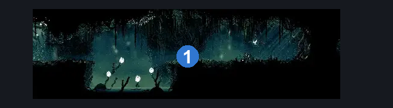
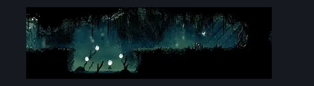

# shellwood Shakra (Shellwood_16)

**Game ID:** Shellwood_16

**Contributors:** Pyxl

## Subrooms

No subrooms defined.

## Room Transitions

| Alias | Name | From subroom | Destination | Destination alias | Requirements | TODO | Verification | Annotated | Notes |
| --- | --- | --- | --- | --- | --- | --- | --- | --- | --- |
| L | left1 |  | [Shellwood Lower Left Tall Room (Shellwood_03)](shellwood-lower-left-tall-room.md) | LR | None |  | Verified | ✓ |  |
| R | right1 |  | [Shellwood Big Room Left (Shellwood_02)](shellwood-big-room-left.md) | LL | None |  | Verified | ✓ |  |

## Subroom Connections

No subroom connections defined.

## Check Locations

| No. | Check | Subroom | Requirements | TODO | Verification | Location Type | Annotated | Notes |
| --- | --- | --- | --- | --- | --- | --- | --- | --- |
| 1 | Map: Shellwood |  | None |  | Verified | collectible | ✓ |  |

## Room Images

### Connections

### Checks

### Scene

