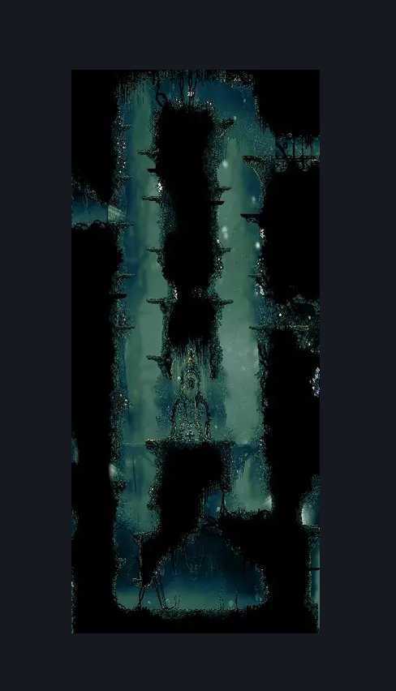
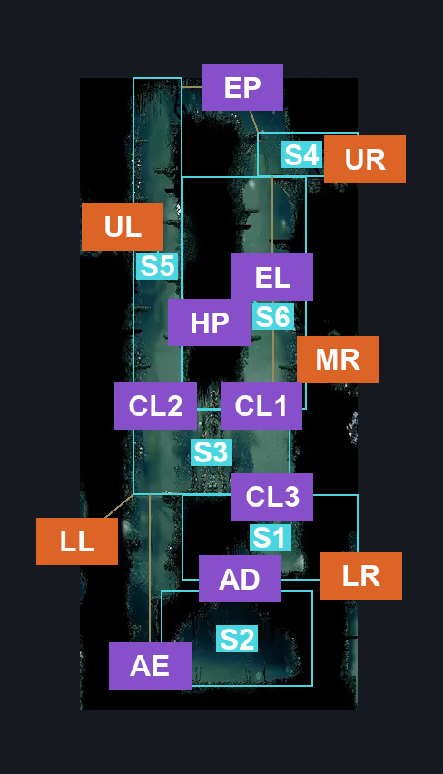
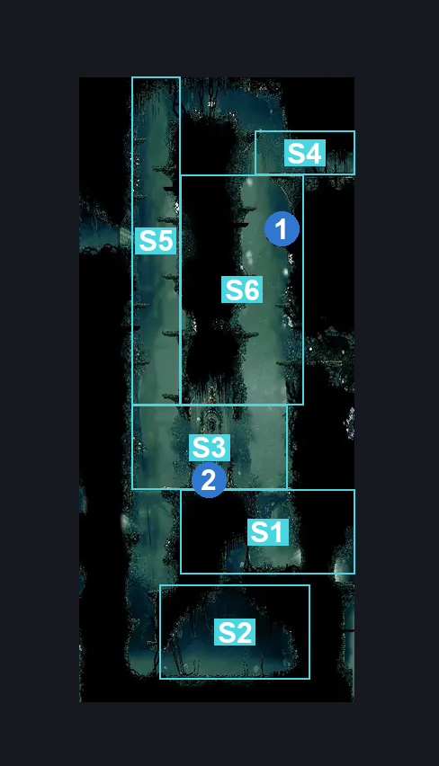

# Shellwood Sister Splinter Bench (Shellwood_01b)

**Game ID:** Shellwood_01b

**Contributors:** Pyxl

## Subrooms

| No. | Subroom | Annotated |
| --- | --- | --- |
| S1 | Above Arena | ✓ |
| S2 | Arena | ✓ |
| S3 | Bench Toll | ✓ |
| S4 | Elevator Platform | ✓ |
| S5 | Upper Main | ✓ |
| S6 | Upper Hidden | ✓ |

## Room Transitions

| Alias | Name | From subroom | Destination | Destination alias | Requirements | TODO | Verification | Annotated | Notes |
| --- | --- | --- | --- | --- | --- | --- | --- | --- | --- |
| UR | right1 | Elevator Platform | [Shellwood Upper Bellhart Entrance (Shellwood_13)](shellwood-upper-bellhart-entrance.md) | LL | None |  | Verified | ✓ |  |
| MR | right3 | Upper Hidden | [Shellwood Hidden Bellhart Connection (Shellwood_15)](shellwood-hidden-bellhart-connection.md) | L | activate Shellwood 15 Wall IN Shellwood Hidden Bellhart Connection |  | Verified | ✓ |  |
| LL | left2 | Bench Toll | [Shellwood Big Room Left (Shellwood_02)](shellwood-big-room-left.md) | UR | None |  | Verified | ✓ |  |
| UL | left1 | Upper Main | [Shellwood Flower Pogo Upper Hall (Shellwood_20)](shellwood-flower-pogo-upper-hall.md) | R | None |  | Verified | ✓ |  |
| LR | right2 | Above Arena | [Shellwood Right Side Big room (Shellwood_01)](shellwood-right-side-big-room.md) | UL | None |  | Verified | ✓ |  |

## Subroom Connections

| Alias | Name | Source | Destination | Requirements | TODO | Verification | Annotated | Notes |
| --- | --- | --- | --- | --- | --- | --- | --- | --- |
| AD | Arena Drop | Above Arena | Arena | None |  | Verified | ✓ |  |
| AD | Arena Drop | Arena | Above Arena | Silk Soar |  | Verified | ✓ |  |
| AE | Arena Exit | Arena | Bench Toll | Ledge Grab OR ( Dash AND Scuttlebrace ) OR Clawline OR Cling Grip OR Faydown Cloak OR Silk Soar |  | Verified | ✓ |  |
| AE | Arena Exit | Bench Toll | Arena | None |  | Verified | ✓ |  |
| CL1 | Climb 1 | Bench Toll | Upper Hidden | ( Cling Grip AND ( Clawline OR Dash OR Sharpdart OR Drifters Cloak OR Faydown Cloak OR easy Beast Crest pogo ) ) OR Silk Soar |  | Verified | ✓ |  |
| CL1 | Climb 1 | Upper Hidden | Bench Toll | None |  | Verified | ✓ |  |
| EL | Elevator | Bench Toll | Elevator Platform | Activate Shellwood Elevator Button 2 |  | Verified | ✓ |  |
| EL | Elevator | Elevator Platform | Bench Toll | Activate Shellwood Elevator Button 2 |  | Verified | ✓ |  |
| CL2 | Climb 2 | Upper Main | Bench Toll | None |  | Verified | ✓ |  |
| CL2 | Climb 2 | Bench Toll | Upper Main | Cling Grip OR Silk Soar |  | Verified | ✓ |  |
| HP | Hidden Path | Upper Main | Upper Hidden | None |  | Verified | ✓ |  |
| HP | Hidden Path | Upper Hidden | Upper Main | None |  | Verified | ✓ |  |
| EP | Elevator Platform | Upper Main | Elevator Platform | None |  | Verified | ✓ |  |
| EP | Elevator Platform | Elevator Platform | Upper Main | Ledge Grab OR ( Dash AND Scuttlebrace ) OR Clawline OR Cling Grip OR Faydown Cloak OR Silk Soar |  | Verified | ✓ |  |
| CL3 | Climb 3 | Above Arena | Bench Toll | Cling Grip OR Silk Soar OR ( Dash AND Scuttlebrace ) |  | Verified | ✓ |  |
| CL3 | Climb 3 | Bench Toll | Above Arena | None |  | Verified | ✓ |  |

## Check Locations

| No. | Check | Subroom | Requirements | TODO | Verification | Location Type | Annotated | Notes |
| --- | --- | --- | --- | --- | --- | --- | --- | --- |
| 1 | Rosary String: Shellwood #1 | Upper Hidden | None |  | Verified | collectible | ✓ |  |
| 2 | Sister Splinter Toll Bench | Bench Toll | None |  | Verified | bench | ✓ |  |
| 3 | Craw Summons | Bench Toll | Craw Summons Ready |  | Verified | collectible |  |  |
| 4 | Shellwood Elevator Button 2 | Elevator Platform | None |  | Verified | switch |  |  |

## Room Images

### Scene

### Connections

### Checks

