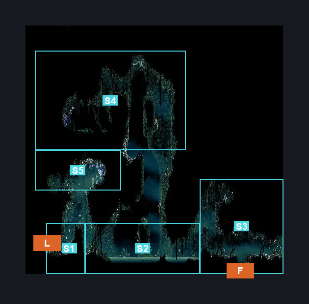
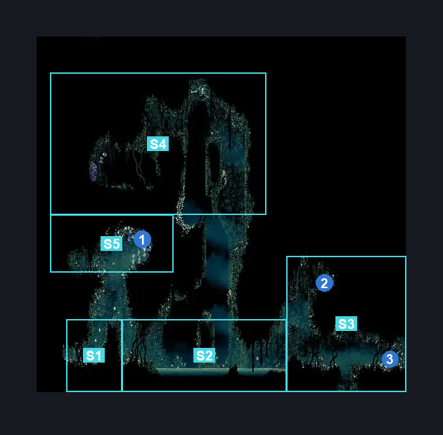
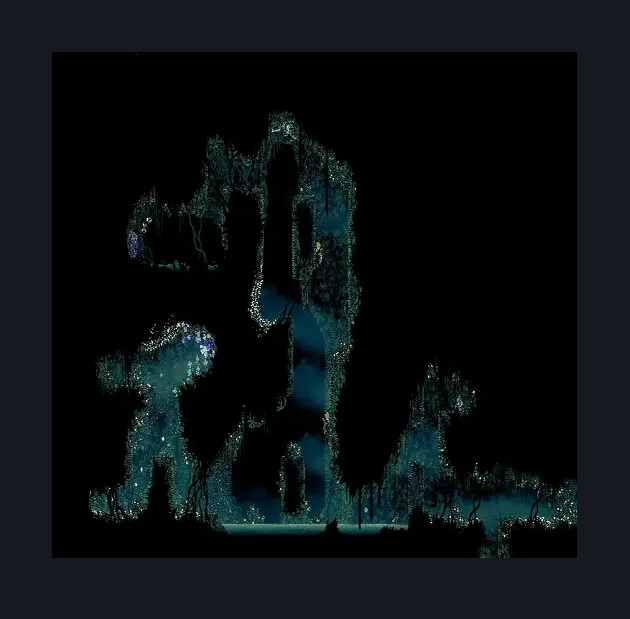

# Shellwood Top Room (Shellwood_26)

**Game ID:** Shellwood_26

**Contributors:** Pyxl

## Subrooms

| No. | Subroom | Annotated |
| --- | --- | --- |
| S1 | Left Side | ✓ |
| S2 | Central | ✓ |
| S3 | Right Side | ✓ |
| S4 | Upper Area | ✓ |
| S5 | Pollip Room | ✓ |

## Room Transitions

| Alias | Name | From subroom | Destination | Destination alias | Requirements | TODO | Verification | Annotated | Notes |
| --- | --- | --- | --- | --- | --- | --- | --- | --- | --- |
| L | left1 | Left Side | [Cling Grip Room (Shellwood_10)](cling-grip-room.md) | UR | None |  | Verified | ✓ |  |
| F | bot1 | Right Side | [Sister Splinter (Shellwood_18)](sister-splinter.md) | C | None |  | Verified | ✓ |  |

## Subroom Connections

| Alias | Name | Source | Destination | Requirements | TODO | Verification | Annotated | Notes |
| --- | --- | --- | --- | --- | --- | --- | --- | --- |
| LW | Left Wall | Left Side | Central | Cling Grip OR Faydown Cloak OR Silk Soar OR ( Dash AND Scuttlebrace ) |  | Verified |  |  |
| LW | Left Wall | Central | Left Side | Cling Grip OR Faydown Cloak OR Silk Soar OR ( Dash AND Scuttlebrace ) |  | Verified |  |  |
| RW | Right Wall | Central | Right Side | ( Swim OR ( Drifters Cloak  AND Easy enemy pogo ) ) AND ( Cling Grip OR Scuttlebrace ) |  | Verified |  |  |
| RW | Right Wall | Right Side | Central | Cling Grip OR Faydown Cloak OR Silk Soar OR ( Dash AND Scuttlebrace ) |  | Verified |  |  |
| HS | Hidden Shaft | Pollip Room | Upper Area | prereq Shellwood 26 Wall AND Silk Soar |  | Verified |  |  |
| HS | Hidden Shaft | Upper Area | Pollip Room | prereq Shellwood 26 Wall |  | Verified |  |  |
| CC | Central Shaft | Central | Upper Area | Cling Grip AND ( ( Swim OR Clawline OR Drifters Cloak OR Sharpdart OR ( easy Beast Crest pogo AND Dash ) OR ( Sprint AND Dash ) ) OR ( Dash AND Scuttlebrace AND ( Swim OR Clawline OR Easy enemy pogo OR Faydown Cloak ) ) ) |  | Verified |  |  |
| CC | Central Shaft | Upper Area | Central | None |  | Verified |  |  |
| PH | Pollip Hole | Central | Pollip Room | Silk Soar OR ( Faydown Cloak AND ( Ledge Grab OR Cling Grip ) ) |  | Verified |  |  |
| PH | Pollip Hole | Pollip Room | Central | None |  | Verified |  |  |

## Check Locations

| No. | Check | Subroom | Requirements | TODO | Verification | Location Type | Annotated | Notes |
| --- | --- | --- | --- | --- | --- | --- | --- | --- |
| 1 | Pollip Heart #4 | Pollip Room | Cling Grip OR Silk Soar OR Clawline OR ( Faydown Cloak AND ( Ledge Grab OR Clawline ) ) |  | Verified | collectible | ✓ |  |
| 2 | Rosary cache: Shellwood | Right Side | Cling Grip OR Silk Soar OR ( Scuttlebrace AND Dash ) |  | Verified | resource | ✓ |  |
| 3 | Resting Site: Shellwood | Right Side | prereq THE A Vassal Lost Wish Promised |  | Verified | event | ✓ |  |
| 4 | Shellwood 26 Wall | Upper Area | None |  | Verified | blockade |  |  |

## Room Images

### Connections

### Checks

### Scene

