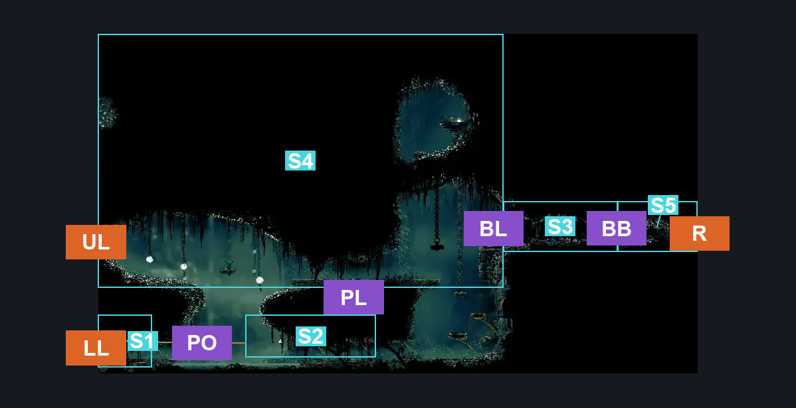
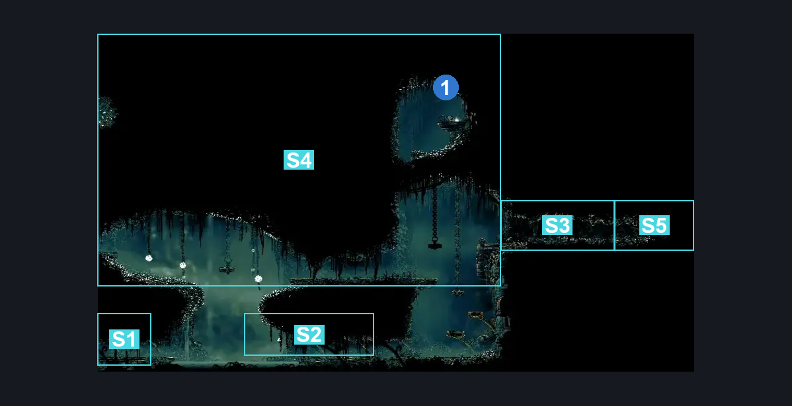
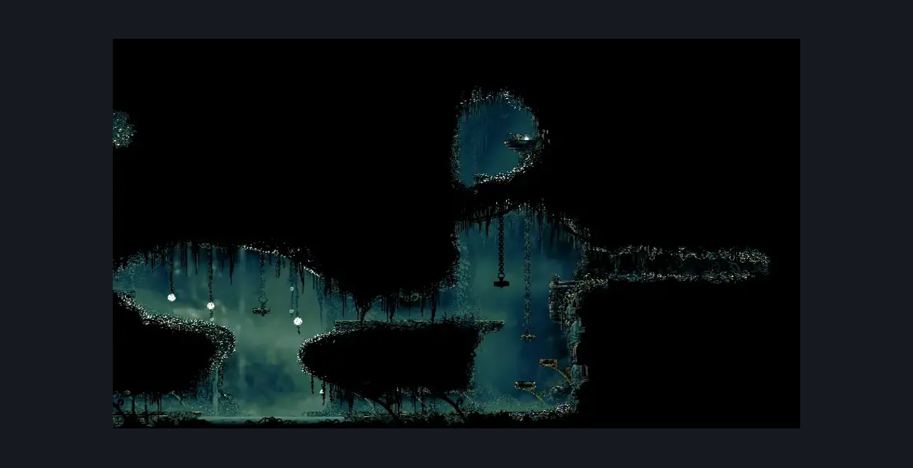

# Shellwood Upper Bellhart Entrance (Shellwood_13)

**Game ID:** Shellwood_13

**Contributors:** Pyxl

## Subrooms

| No. | Subroom | Annotated |
| --- | --- | --- |
| S1 | Left Pond | ✓ |
| S2 | Right Pond | ✓ |
| S3 | Bell Ledge | ✓ |
| S4 | Upper Area | ✓ |
| S5 | Right Exit Area | ✓ |

## Room Transitions

| Alias | Name | From subroom | Destination | Destination alias | Requirements | TODO | Verification | Annotated | Notes |
| --- | --- | --- | --- | --- | --- | --- | --- | --- | --- |
| UL | left1 | Upper Area | [Sister Splinter (Shellwood_18)](sister-splinter.md) | R | ((( Easy Hunter Crest pogo OR Easy Beast Crest pogo OR medium Architect Crest pogo ) AND Ledge Grab) OR ( Medium Heal Stall AND ( medium Reaper Crest pogo OR Hard Shaman Crest pogo OR easy Wanderer Crest pogo OR hard Witch Crest pogo ) ) ) OR Clawline OR Dash OR Drifter's Cloak OR Faydown Cloak OR Sharpdart |  | Verified | ✓ |  |
| R | right1 | Right Exit Area | [Upper Bellhart (Belltown_04)](../bellhart/upper-bellhart.md) | UL | None |  | Verified | ✓ |  |
| LL | left2 | Left Pond | [Shellwood Sister Splinter Bench (Shellwood_01b)](shellwood-sister-splinter-bench.md) | UR | None |  | Verified | ✓ |  |

## Subroom Connections

| Alias | Name | Source | Destination | Requirements | TODO | Verification | Annotated | Notes |
| --- | --- | --- | --- | --- | --- | --- | --- | --- |
| BL | Bell Ledge | Bell Ledge | Upper Area | None |  | Verified | ✓ |  |
| BL | Bell Ledge | Upper Area | Bell Ledge | Cling Grip OR Faydown Cloak OR Silk soar OR ( Dash AND Scuttlebrace ) |  | Verified | ✓ |  |
| PO | Pond | Left Pond | Right Pond | Swim OR Clawline OR (Drifter's Cloak AND (Faydown Cloak OR (Sprint AND Dash) OR (Sharpdart AND Ledge Grab))) OR (Faydown Cloak AND Sharpdart AND (Dash OR easy Beast Crest pogo )) |  | Verified | ✓ |  |
| PO | Pond | Right Pond | Left Pond | Swim OR ( Clawline AND ( Ledge Grab OR Dash OR Sharpdart OR easy beast Crest pogo OR Faydown Cloak ) ) OR ( Sprint AND ( ( Sharpdart AND Dash ) OR ( Sharpdart AND easy Beast Crest pogo ) OR ( Faydown Cloak AND Drifters Cloak ) OR ( Sharpdart AND Drifters Cloak) OR ( Faydown Cloak AND Sharpdart ) ) ) |  | Verified | ✓ |  |
| PL | Platforms | Upper Area | Right Pond | None |  | Verified | ✓ |  |
| PL | Platforms | Right Pond | Upper Area | Ledge Grab OR Dash OR Clawline OR Faydown Cloak OR Cling Grip OR Silk soar |  | Verified | ✓ |  |
| BB | Break Bell Walls | Bell Ledge | Right Exit Area | Break Wall Right |  | Verified | ✓ |  |
| BB | Break Bell Walls | Right Exit Area | Bell Ledge | Break Wall Left |  | Verified | ✓ |  |

## Check Locations

| No. | Check | Subroom | Requirements | TODO | Verification | Location Type | Annotated | Notes |
| --- | --- | --- | --- | --- | --- | --- | --- | --- |
| 1 | Shard Bundle: Shellwood | Upper Area | (Cling Grip AND Faydown Cloak ) OR Silk Soar OR ( Faydown Cloak AND Dash AND Scuttlebrace ) |  | Verified | collectible | ✓ |  |
| 2 | import enemies |  |  | TODO | Needs verification |  |  |  |

## Room Images

### Connections

### Checks

### Scene

