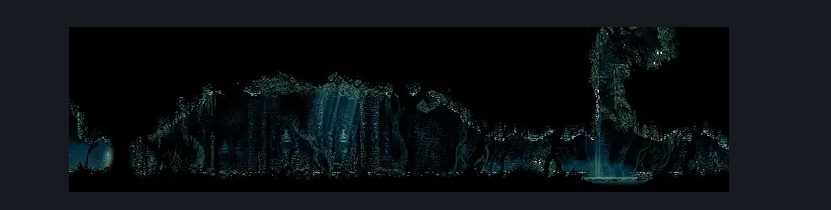
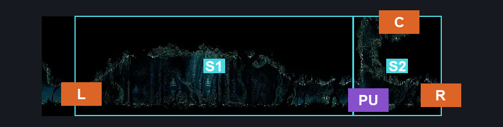
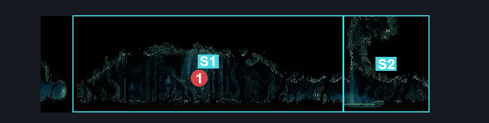

# Sister Splinter (Shellwood_18)

**Game ID:** Shellwood_18

**Contributors:** Pyxl

## Subrooms

| No. | Subroom | Annotated |
| --- | --- | --- |
| S1 | Arena Side | ✓ |
| S2 | Right Side | ✓ |

## Room Transitions

| Alias | Name | From subroom | Destination | Destination alias | Requirements | TODO | Verification | Annotated | Notes |
| --- | --- | --- | --- | --- | --- | --- | --- | --- | --- |
| L | left1 | Arena Side | [Cling Grip Room (Shellwood_10)](cling-grip-room.md) | MR | None |  | Verified | ✓ |  |
| R | right1 | Right Side | [Shellwood Upper Bellhart Entrance (Shellwood_13)](shellwood-upper-bellhart-entrance.md) | UL | None |  | Verified | ✓ |  |
| C | top1 | Right Side | [Shellwood Top Room (Shellwood_26)](shellwood-top-room.md) | F | Cling Grip OR ( Dash AND Scuttlebrace ) |  | Verified | ✓ |  |

## Subroom Connections

| Alias | Name | Source | Destination | Requirements | TODO | Verification | Annotated | Notes |
| --- | --- | --- | --- | --- | --- | --- | --- | --- |
| PU | Puddle | Arena Side | Right Side | Swim OR ( Cling Grip AND Ledge grab ) OR Dash OR Clawline OR SharpDart OR Drifters Cloak OR Faydown Cloak OR easy Beast Crest pogo |  | Verified | ✓ |  |
| PU | Puddle | Right Side | Arena Side | Swim OR Dash OR Clawline OR SharpDart OR Drifters Cloak OR Faydown Cloak OR easy Beast Crest pogo |  | Verified | ✓ |  |

## Check Locations

| No. | Check | Subroom | Requirements | TODO | Verification | Location Type | Annotated | Notes |
| --- | --- | --- | --- | --- | --- | --- | --- | --- |
| 1 | Boss: Sister Splinter | Arena Side | None |  | Verified | boss | ✓ |  |

## Room Images

### Scene

### Connections

### Checks

