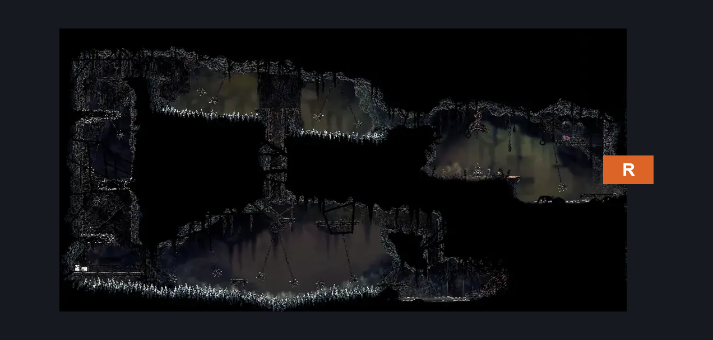
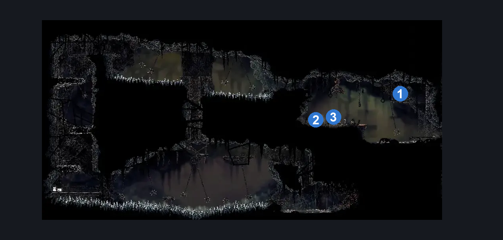
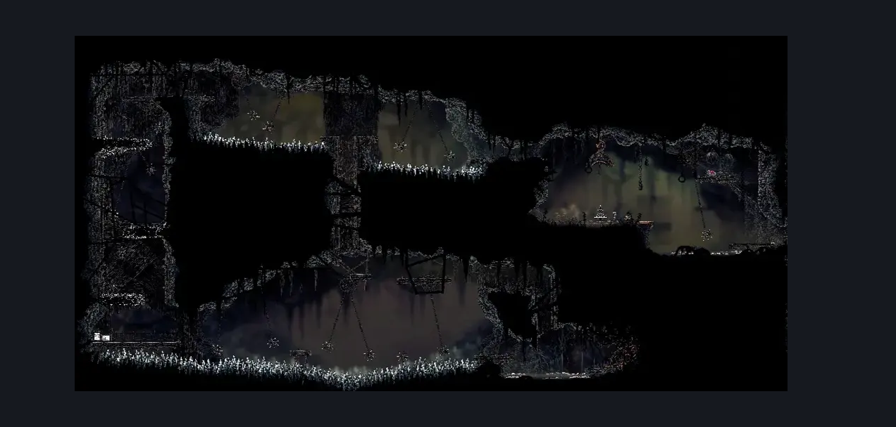

# Sinner's Road Bench (Dust_10)

**Game ID:** Dust_10

**Contributors:** herchey when he was chillin'

## Subrooms

No subrooms defined.

## Room Transitions

| Alias | Name | From subroom | Destination | Destination alias | Requirements | TODO | Verification | Annotated | Notes |
| --- | --- | --- | --- | --- | --- | --- | --- | --- | --- |
| R | right |  | [Sinner's Road Vertical Hall West (Dust_02)](sinner-s-road-vertical-hall-west.md) | ML | none |  | Verified | ✓ |  |

## Subroom Connections

No subroom connections defined.

## Check Locations

| No. | Check | Subroom | Requirements | TODO | Verification | Location Type | Annotated | Notes |
| --- | --- | --- | --- | --- | --- | --- | --- | --- |
| 1 | Rosary Cache: Sinner’s Road #8 |  | Silk soar OR (Faydown AND cling grip) |  | Verified | collectible | ✓ |  |
| 2 | Map Purchase: Sinner's Road |  | Silk Soar OR (spike pogo AND (swim OR ledge grab)) |  | Verified | collectible | ✓ |  |
| 3 | Sinner's Road Bench |  | rosaries 40 AND (cling grip OR silk soar) AND break wall left AND break vines right AND ((faydown cloak AND clawline) OR (spike pogo AND swim)) |  | Verified | bench | ✓ |  |
| 4 | Craw Summons |  | Craw Summons Ready |  | Verified | collectible |  |  |

## Room Images

### Connections

### Checks

### Scene

