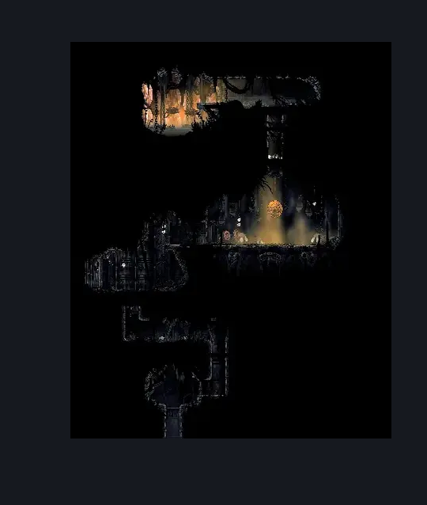
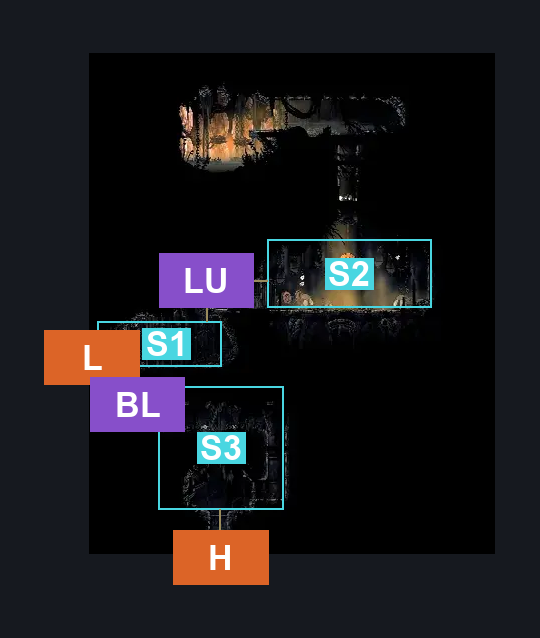
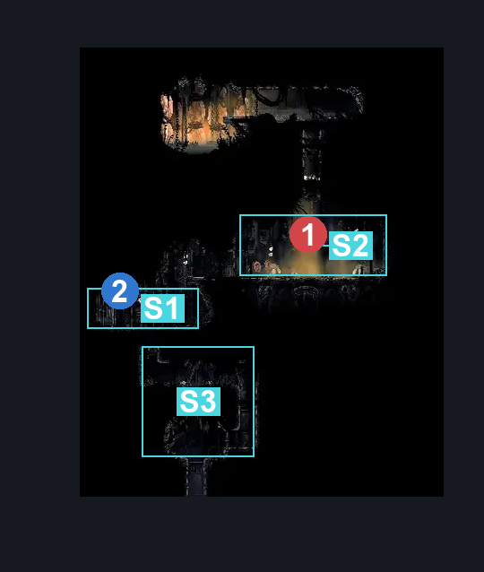

# Sinner's Road Chef's Kitchen (Dust_Chef)

**Game ID:** Dust_Chef

**Contributors:** herchey and some pop-tarts

## Subrooms

| No. | Subroom | Annotated |
| --- | --- | --- |
| S1 | lower | ✓ |
| S2 | upper | ✓ |
| S3 | basement | ✓ |

## Room Transitions

| Alias | Name | From subroom | Destination | Destination alias | Requirements | TODO | Verification | Annotated | Notes |
| --- | --- | --- | --- | --- | --- | --- | --- | --- | --- |
| L | left | lower | [Sinner's Road Hanging Cages (Dust_04)](sinner-s-road-hanging-cages.md) | R | prereq Sinner's Road Chef's Kitchen Door Switch |  | Verified | ✓ |  |
| H | hatch | basement | [Sinner's Road Muckroach Cages (Dust_03)](sinner-s-road-muckroach-cages.md) | C | none |  | Verified | ✓ |  |

## Subroom Connections

| Alias | Name | Source | Destination | Requirements | TODO | Verification | Annotated | Notes |
| --- | --- | --- | --- | --- | --- | --- | --- | --- |
| LU | lower to upper | lower | upper | faydown cloak OR silk soar |  | Verified | ✓ |  |
| LU | lower to upper | upper | lower | none |  | Verified | ✓ |  |
| BL | basement to lower | basement | lower | scuttlebrace OR cling grip OR silk soar |  | Verified | ✓ |  |
| BL | basement to lower | lower | basement | invalid (true one-way) |  | Verified | ✓ |  |

## Check Locations

| No. | Check | Subroom | Requirements | TODO | Verification | Location Type | Annotated | Notes |
| --- | --- | --- | --- | --- | --- | --- | --- | --- |
| 1 | Boss: Disgraced Chef Lugoli | upper | none |  | Verified | boss | ✓ |  |
| 2 | Sinner's Road Chef's Kitchen Door Switch | lower | hit switch up OR hit switch left |  | Verified | switch | ✓ |  |

## Room Images

### Scene

### Connections

### Checks

