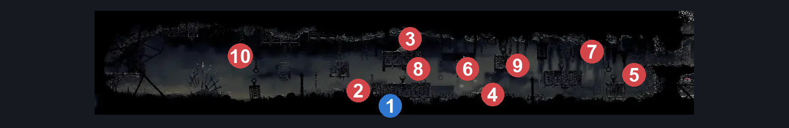
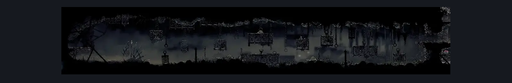

# Sinner's Road Entrance (Dust_01)

**Game ID:** Dust_01

**Contributors:** herchey and Moriko Kyoho's dog

## Subrooms

No subrooms defined.

## Room Transitions

| Alias | Name | From subroom | Destination | Destination alias | Requirements | TODO | Verification | Annotated | Notes |
| --- | --- | --- | --- | --- | --- | --- | --- | --- | --- |
| L | left |  | [Greymoor Halfway Home Exterior (Greymoor_03)](../greymoor/greymoor-halfway-home-exterior.md) | UR | ledge grab OR cling grip OR silk soar OR faydown cloak OR scuttlebrace |  | Verified | ✓ |  |
| R | right |  | [Sinner's Road Vertical Hall West (Dust_02)](sinner-s-road-vertical-hall-west.md) | LL | ledge grab OR cling grip OR silk soar OR faydown cloak OR scuttlebrace |  | Verified | ✓ |  |

## Subroom Connections

No subroom connections defined.

## Check Locations

| No. | Check | Subroom | Requirements | TODO | Verification | Location Type | Annotated | Notes |
| --- | --- | --- | --- | --- | --- | --- | --- | --- |
| 1 | Frayed Rosary String: Sinner's Road |  | break wall left |  | Verified | collectible | ✓ |  |

## Room Images

### Connections

### Checks

### Scene

