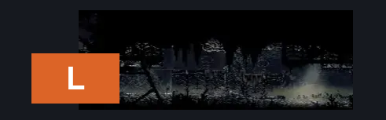
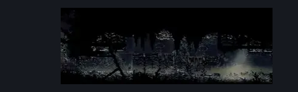

# Sinner's Road Flea Rescue (Dust_12)

**Game ID:** Dust_12

**Contributors:** herchey!!!!!

## Subrooms

No subrooms defined.

## Room Transitions

| Alias | Name | From subroom | Destination | Destination alias | Requirements | TODO | Verification | Annotated | Notes |
| --- | --- | --- | --- | --- | --- | --- | --- | --- | --- |
| L | left |  | [Sinner's Road Vertical Hall East (Dust_06)](sinner-s-road-vertical-hall-east.md) | MR | none |  | Verified | ✓ |  |

## Subroom Connections

No subroom connections defined.

## Check Locations

| No. | Check | Subroom | Requirements | TODO | Verification | Location Type | Annotated | Notes |
| --- | --- | --- | --- | --- | --- | --- | --- | --- |
| 1 | Flea: Sinner's Road |  | break wall left |  | Verified | collectible |  |  |
| 2 | import enemies |  |  | TODO | Needs verification |  |  |  |

## Room Images

### Connections

### Checks

### Scene

