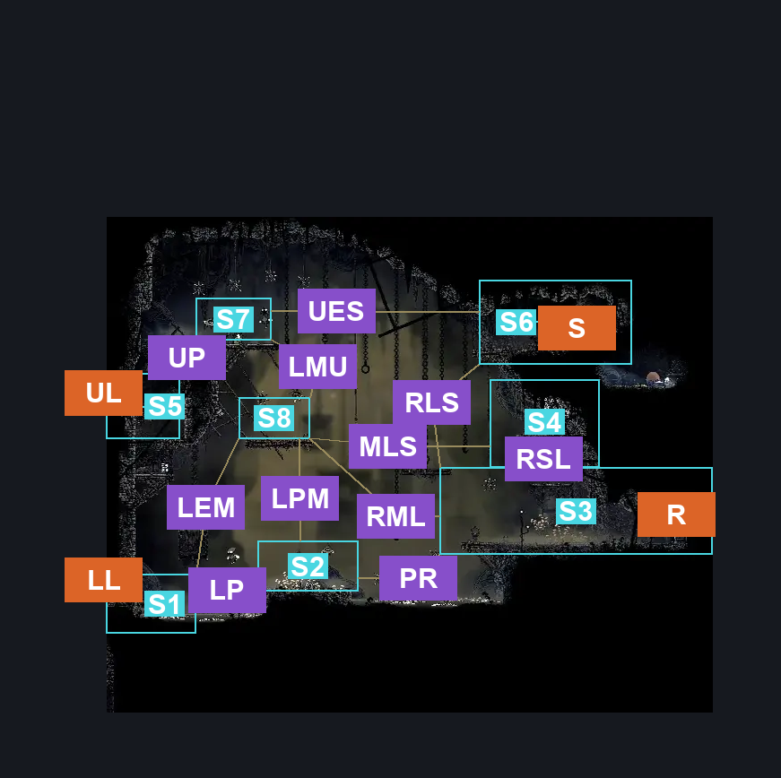
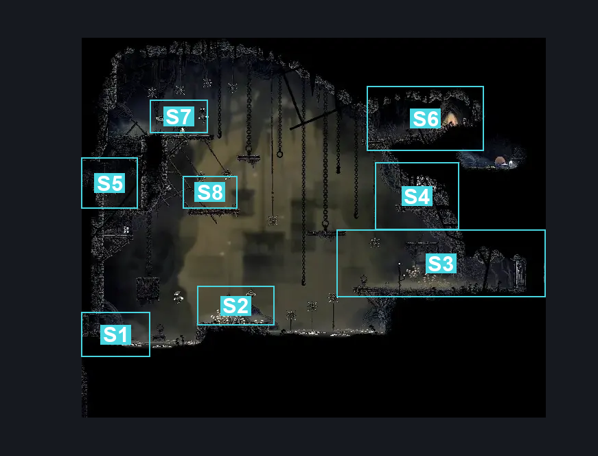
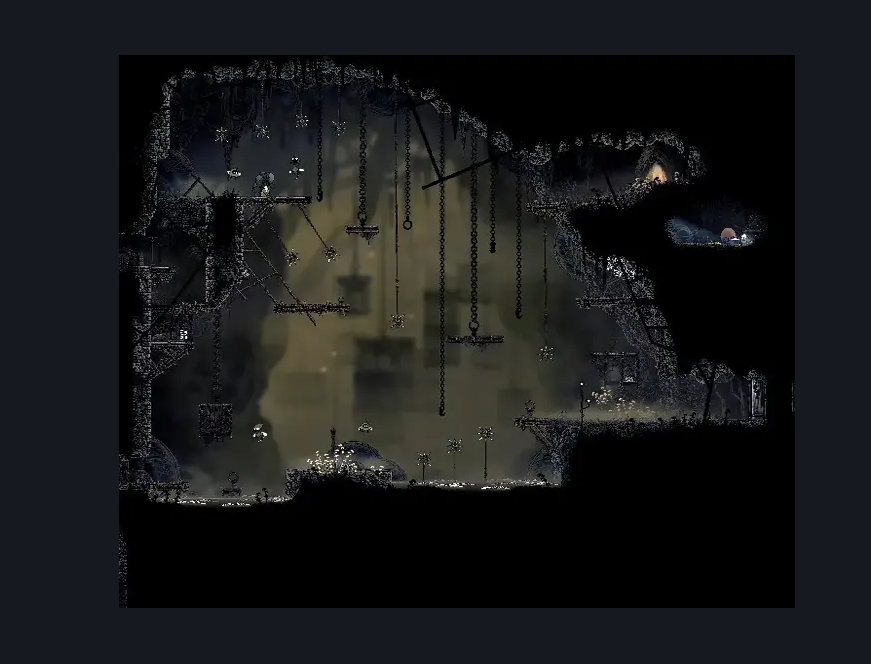

# Sinner's Road Hanging Cages (Dust_04)

**Game ID:** Dust_04

**Contributors:** herchey and Lace (she didn't help at all because she was on the phone with Hornet the whole time)

## Subrooms

| No. | Subroom | Annotated |
| --- | --- | --- |
| S1 | lower entry | ✓ |
| S2 | lower platform | ✓ |
| S3 | right ledge | ✓ |
| S4 | shard ledge | ✓ |
| S5 | upper entry | ✓ |
| S6 | shack | ✓ |
| S7 | plat above upper door | ✓ |
| S8 | middle left plat | ✓ |

## Room Transitions

| Alias | Name | From subroom | Destination | Destination alias | Requirements | TODO | Verification | Annotated | Notes |
| --- | --- | --- | --- | --- | --- | --- | --- | --- | --- |
| LL | lower left | lower entry | [Sinner's Road Vertical Hall West (Dust_02)](sinner-s-road-vertical-hall-west.md) | MR | none |  | Verified | ✓ |  |
| R | right | right ledge | [Sinner's Road Chef's Kitchen (Dust_Chef)](sinner-s-road-chef-s-kitchen.md) | L | none |  | Verified | ✓ |  |
| UL | upper left | upper entry | [Sinner's Road Vertical Hall West (Dust_02)](sinner-s-road-vertical-hall-west.md) | UR | none |  | Verified | ✓ |  |
| S | shack | shack | [Sinner's Road Shack (dust_shack)](sinner-s-road-shack.md) | L | none |  | Verified | ✓ |  |

## Subroom Connections

| Alias | Name | Source | Destination | Requirements | TODO | Verification | Annotated | Notes |
| --- | --- | --- | --- | --- | --- | --- | --- | --- |
| RSL | right ledge to shard ledge | right ledge | shard ledge | Faydown cloak OR silk soar OR (cling grip AND enemy pogo AND (clawline OR sharpdart)) |  | Verified | ✓ |  |
| RSL | right ledge to shard ledge | shard ledge | right ledge | none |  | Verified | ✓ |  |
| UES | upper entry to shack | plat above upper door | shack | Clawline OR ((Cling grip OR silk soar) AND enemy pogo AND (drifter’s cloak OR sharpdart)) |  | Verified | ✓ |  |
| UES | upper entry to shack | shack | plat above upper door | Run AND (faydown cloak OR clawline OR sharpdart) |  | Verified | ✓ |  |
| RLS | right ledge to shack | right ledge | shack | silk soar |  | Verified | ✓ |  |
| RLS | right ledge to shack | shack | right ledge | none |  | Verified | ✓ |  |
| LP | lower entry to lower platform | lower entry | lower platform | ledge grab OR cling grip OR clawline OR sharpdart OR run OR dash OR drifter's cloak OR faydown cloak OR easy beast pogo OR easy wanderer needle strike OR easy architect needle strike |  | Verified | ✓ |  |
| LP | lower entry to lower platform | lower platform | lower entry | none |  | Verified | ✓ |  |
| PR | lower platform to right ledge | lower platform | right ledge | clawline OR enemy pogo OR (faydown cloak AND drifter's cloak AND ledge grab AND (sharpdart OR dash OR run)) |  | Verified | ✓ |  |
| PR | lower platform to right ledge | right ledge | lower platform | clawline OR sharpdart OR swim OR enemy pogo OR drifter's cloak OR dash |  | Verified | ✓ |  |
| UP | upper entry to upper plat | upper entry | plat above upper door | ledge grab OR cling grip OR silk soar OR faydown cloak |  | Verified | ✓ |  |
| UP | upper entry to upper plat | plat above upper door | upper entry | none |  | Verified | ✓ |  |
| LPM | lower plat to mid left plat | lower platform | middle left plat | silk soar |  | Verified | ✓ |  |
| LPM | lower plat to mid left plat | middle left plat | lower platform | none |  | Verified | ✓ |  |
| LEM | lower entry to mid left plat | lower entry | middle left plat | cling grip AND faydown cloak |  | Verified | ✓ |  |
| LEM | lower entry to mid left plat | middle left plat | lower entry | none |  | Verified | ✓ |  |
| LMU | middle left plat to upper | middle left plat | plat above upper door | silk soar OR (cling grip AND (clawline OR enemy pogo)) OR (faydown cloak AND (enemy pogo OR (clawline AND (ledge grab OR cling grip)))) |  | Verified | ✓ |  |
| LMU | middle left plat to upper | plat above upper door | middle left plat | none |  | Verified | ✓ |  |
| MLS | middle left to shard | middle left plat | shard ledge | faydown cloak OR (run AND (ledge grab OR cling grip)) OR (clawline AND (ledge grab OR cling grip)) |  | Verified | ✓ |  |
| MLS | middle left to shard | shard ledge | middle left plat | ((ledge grab OR cling grip) AND (dash OR clawline x 2 OR sharpdart x 2)) |  | Verified | ✓ |  |
| RML | right ledge to middle left | right ledge | middle left plat | ((cling grip OR silk soar OR (faydown cloak AND ledge grab)) AND (((enemy pogo OR clawline OR (dash AND drifter's cloak) OR sharpdart x 2) AND (ledge grab OR cling grip)) OR (faydown cloak AND dash))) |  | Verified | ✓ |  |
| RML | right ledge to middle left | middle left plat | right ledge | run OR dash OR clawline OR sharpdart OR drifter's cloak OR faydown cloak |  | Verified | ✓ |  |

## Check Locations

| No. | Check | Subroom | Requirements | TODO | Verification | Location Type | Annotated | Notes |
| --- | --- | --- | --- | --- | --- | --- | --- | --- |
| 1 | My Missing Brother Wish Granted | upper entry | complete THE My Missing Brother Wish Promised |  | Verified | event |  |  |
| 2 | Shell Shard Cache: Sinner’s Road #4 | shard ledge | none |  | Verified | collectible |  |  |
| 3 | Shell Shard Cache: Sinner’s Road #5 | shard ledge | none |  | Verified | collectible |  |  |
| 4 | Upper Entry Switch | upper entry | hit switch left OR hit switch up |  | Verified | switch |  |  |

## Room Images

### Connections

### Checks

### Scene

