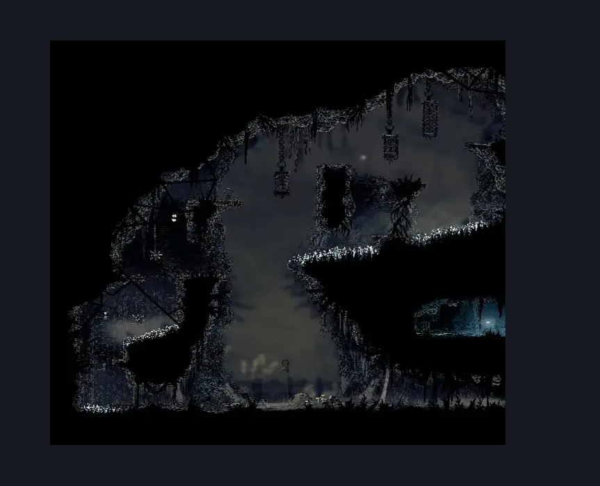
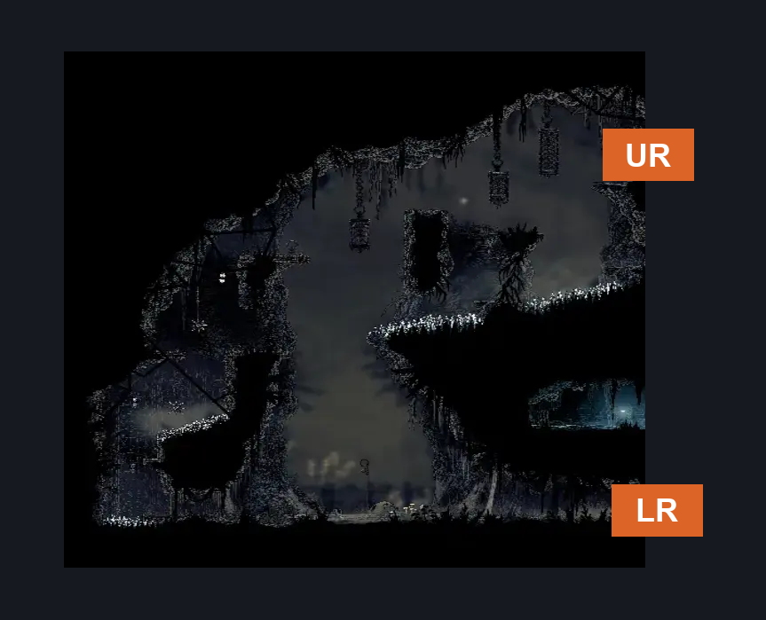

# Sinner's Road Mist Maze Completed (Dust_Maze_08_completed)

**Game ID:** Dust_Maze_08_completed

**Contributors:** Herchey and a gallon of milk

## Subrooms

No subrooms defined.

## Room Transitions

| Alias | Name | From subroom | Destination | Destination alias | Requirements | TODO | Verification | Annotated | Notes |
| --- | --- | --- | --- | --- | --- | --- | --- | --- | --- |
| UR | up right |  | [Exhaust Organ Exterior (Dust_09)](../bilewater/exhaust-organ-exterior.md) | L | cling grip AND (silk soar OR clawline OR sharpdart OR drifter's cloak OR faydown cloak OR (enemy pogo AND run)) |  | Verified | ✓ |  |
| LR | low right |  | [Sinner's Road North Hall (Dust_05)](sinner-s-road-north-hall.md) | L | spike pogo OR clawline OR sharpdart OR faydown cloak OR drifter's cloak OR scuttlebrace OR run OR dash OR cling grip |  | Verified | ✓ |  |

## Subroom Connections

No subroom connections defined.

## Check Locations

No check locations defined.

## Room Images

### Scene

### Connections

### Checks

