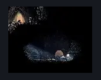

# Sinner's Road Shack (dust_shack)

**Game ID:** dust_shack

**Contributors:** herchey

## Subrooms

No subrooms defined.

## Room Transitions

| Alias | Name | From subroom | Destination | Destination alias | Requirements | TODO | Verification | Annotated | Notes |
| --- | --- | --- | --- | --- | --- | --- | --- | --- | --- |
| L | left |  | [Sinner's Road Hanging Cages (Dust_04)](sinner-s-road-hanging-cages.md) | S | none |  | Verified | ✓ |  |

## Subroom Connections

No subroom connections defined.

## Check Locations

| No. | Check | Subroom | Requirements | TODO | Verification | Location Type | Annotated | Notes |
| --- | --- | --- | --- | --- | --- | --- | --- | --- |
| 1 | Roach Guts Wish Promised |  | act 2 |  | Verified | event |  |  |
| 2 | Roach Guts Wish Granted |  | get 10 roach guts |  | Verified | event |  |  |
| 3 | Tacks |  | complete Roach Guts Wish Granted OR act 3 |  | Verified | collectible |  |  |
| 4 | Steel Spines |  | complete THE Infestation Operation Wish Promised AND ( ( act 2 AND spend 160 rosaries ) OR act 3 ) |  | Verified | collectible |  | Free in act 3 cause they ded |

## Room Images

### Connections

### Checks

### Scene

