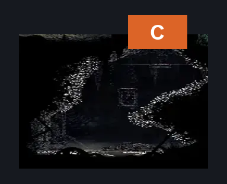
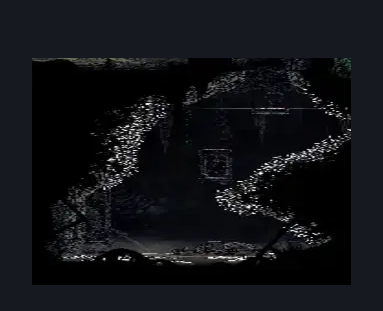

# Sinner's Road Spike Basement (Dust_Barb)

**Game ID:** Dust_Barb

**Contributors:** herchey's basement

## Subrooms

| No. | Subroom | Annotated |
| --- | --- | --- |
| S1 | upper |  |
| S2 | lower |  |

## Room Transitions

| Alias | Name | From subroom | Destination | Destination alias | Requirements | TODO | Verification | Annotated | Notes |
| --- | --- | --- | --- | --- | --- | --- | --- | --- | --- |
| C | ceiling | upper | [Sinner's Road Muckroach Cages (Dust_03)](sinner-s-road-muckroach-cages.md) | LR | none |  | Verified | ✓ |  |

## Subroom Connections

| Alias | Name | Source | Destination | Requirements | TODO | Verification | Annotated | Notes |
| --- | --- | --- | --- | --- | --- | --- | --- | --- |
| UL | Upper to lower | upper | lower | none |  | Verified |  |  |
| UL | Upper to lower | lower | upper | Silk soar OR cling grip |  | Verified |  |  |

## Check Locations

| No. | Check | Subroom | Requirements | TODO | Verification | Location Type | Annotated | Notes |
| --- | --- | --- | --- | --- | --- | --- | --- | --- |
| 1 | Barbed Bracelet | lower | none |  | Verified | collectible |  |  |

## Room Images

### Connections

### Checks

### Scene

