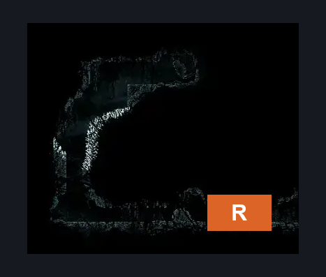
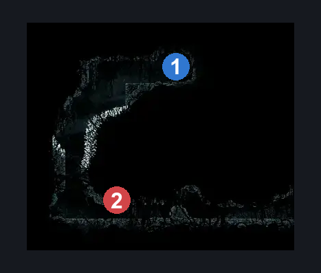
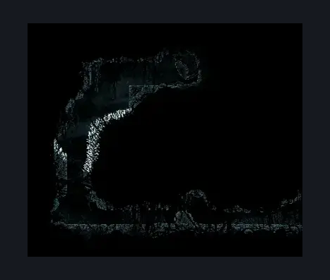

# Abyss Bottom Left Lore Room (Abyss_06)

**Game ID:** Abyss_06

**Contributors:** Pyxl

## Subrooms

No subrooms defined.

## Room Transitions

| Alias | Name | From subroom | Destination | Destination alias | Requirements | TODO | Verification | Annotated | Notes |
| --- | --- | --- | --- | --- | --- | --- | --- | --- | --- |
| R | right1 |  | [Abyss Tall Room (Abyss_01)](abyss-tall-room.md) | L | None |  | Verified | ✓ |  |

## Subroom Connections

No subroom connections defined.

## Check Locations

| No. | Check | Subroom | Requirements | TODO | Verification | Location Type | Annotated | Notes |
| --- | --- | --- | --- | --- | --- | --- | --- | --- |
| 1 | Lore: Abyss #3 |  | ( Faydown Cloak AND ( easy Reaper Crest pogo OR Cling Grip ) ) OR ( Silk Soar AND ( ( ( Proficient Movement AND spike pogo ) AND Ledge grab ) OR Cling Grip OR Clawline OR Scuttlebrace )  ) |  | Verified | lore | ✓ |  |
| 2 | Shadow Charger 1 |  |  |  |  | enemy | ✓ |  |

## Room Images

### Connections

### Checks

### Scene

