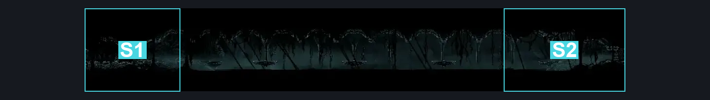
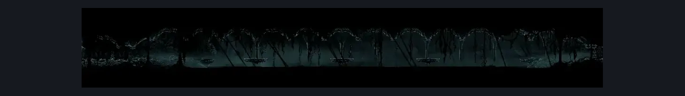

# Abyss Collapsing Hallway (Abyss_07)

**Game ID:** Abyss_07

**Contributors:** Pyxl

## Subrooms

| No. | Subroom | Annotated |
| --- | --- | --- |
| S1 | Left | ✓ |
| S2 | Right | ✓ |

## Room Transitions

| Alias | Name | From subroom | Destination | Destination alias | Requirements | TODO | Verification | Annotated | Notes |
| --- | --- | --- | --- | --- | --- | --- | --- | --- | --- |
| L | left1 | Left | [Abyss Tall Room (Abyss_01)](abyss-tall-room.md) | LR | None |  | Verified | ✓ |  |
| R | right1 | Right | [Abyss Final Bench (Abyss_12)](abyss-final-bench.md) | L | None |  | Verified | ✓ |  |

## Subroom Connections

| Alias | Name | Source | Destination | Requirements | TODO | Verification | Annotated | Notes |
| --- | --- | --- | --- | --- | --- | --- | --- | --- |
| CR | Crossing | Left | Right | have Everbloom OR Clawline OR ( ( Sprint OR Dash OR Sharpdart ) AND Faydown Cloak AND Drifters Cloak ) |  | Verified | ✓ |  |
| CR | Crossing | Right | Left | have Everbloom OR Clawline OR ( ( Sprint OR Dash OR Sharpdart ) AND Faydown Cloak AND Drifters Cloak ) |  | Verified | ✓ |  |

## Check Locations

No check locations defined.

## Room Images

### Connections

### Checks

### Scene

