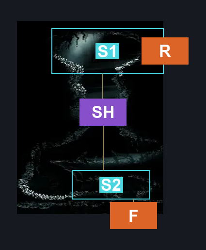
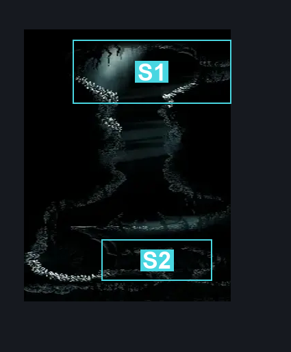
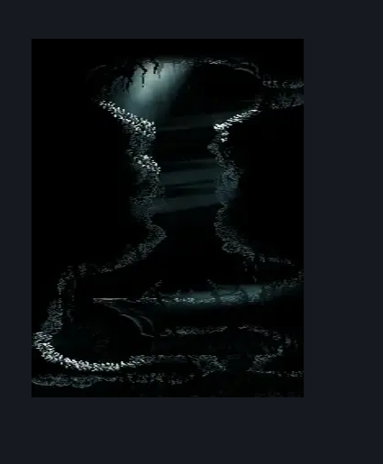

# Abyss Drop Down From Escape Hall (Abyss_11)

**Game ID:** Abyss_11

**Contributors:** Pyxl

## Subrooms

| No. | Subroom | Annotated |
| --- | --- | --- |
| S1 | Top | ✓ |
| S2 | Bottom | ✓ |

## Room Transitions

| Alias | Name | From subroom | Destination | Destination alias | Requirements | TODO | Verification | Annotated | Notes |
| --- | --- | --- | --- | --- | --- | --- | --- | --- | --- |
| R | right1 | Top | [Abyss Escape Hallway (Abyss_13)](abyss-escape-hallway.md) | L | None |  | Verified | ✓ |  |
| F | bot1 | Bottom | [Abyss Upper Big Room (Abyss_02b)](abyss-upper-big-room.md) | C | None |  | Verified | ✓ |  |

## Subroom Connections

| Alias | Name | Source | Destination | Requirements | TODO | Verification | Annotated | Notes |
| --- | --- | --- | --- | --- | --- | --- | --- | --- |
| SH | Shaft | Top | Bottom | None |  | Verified | ✓ | Spike Pogo |
| SH | Shaft | Bottom | Top | Silk Soar AND ( Cling Grip OR ( easy Reaper Crest pogo AND Ledge Grab ) OR Scuttlebrace ) |  | Verified | ✓ |  |

## Check Locations

No check locations defined.

## Room Images

### Connections

### Checks

### Scene

