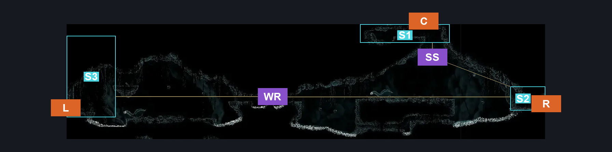
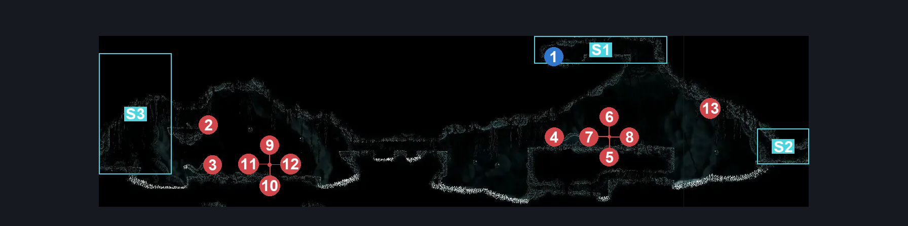
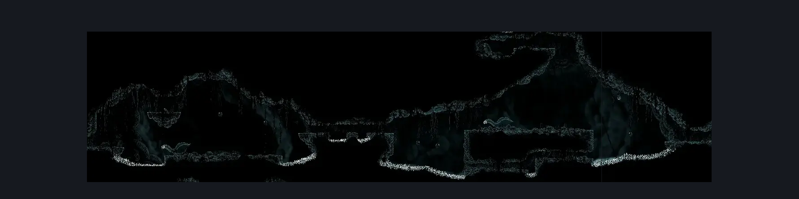

# Abyss Upper Big Room (Abyss_02b)

**Game ID:** Abyss_02b

**Contributors:** Pyxl

## Subrooms

| No. | Subroom | Annotated |
| --- | --- | --- |
| S1 | Upper Zone | ✓ |
| S2 | Right Exit | ✓ |
| S3 | Left Exit | ✓ |

## Room Transitions

| Alias | Name | From subroom | Destination | Destination alias | Requirements | TODO | Verification | Annotated | Notes |
| --- | --- | --- | --- | --- | --- | --- | --- | --- | --- |
| L | left2 | Left Exit | [Abyss Tall Room (Abyss_01)](abyss-tall-room.md) | UR | None |  | Verified | ✓ |  |
| C | top1 | Upper Zone | [Abyss Drop Down From Escape Hall (Abyss_11)](abyss-drop-down-from-escape-hall.md) | F | NOne |  | Verified | ✓ |  |
| R | right1 | Right Exit | [Abyss Hallway To Upper Big Room (Abyss_02)](abyss-hallway-to-upper-big-room.md) | L | None |  | Verified | ✓ |  |

## Subroom Connections

| Alias | Name | Source | Destination | Requirements | TODO | Verification | Annotated | Notes |
| --- | --- | --- | --- | --- | --- | --- | --- | --- |
| WR | Whole Room | Left Exit | Right Exit | Faydown Cloak OR ( Silk Soar AND ( Ledge grab OR Cling Grip OR Clawline OR Dash OR Drifters Cloak OR Sharpdart ) ) |  | Verified | ✓ |  |
| WR | Whole Room | Right Exit | Left Exit | Cling Grip OR Faydown Cloak OR Clawline |  | Verified | ✓ |  |
| SS | Silk Soar Shaft | Right Exit | Upper Zone | Silk Soar AND ( Faydown Cloak OR Drifters Cloak OR Clawline OR Cling grip OR Scuttlebrace ) |  | Verified | ✓ |  |
| SS | Silk Soar Shaft | Upper Zone | Right Exit | None |  | Verified | ✓ |  |

## Check Locations

| No. | Check | Subroom | Requirements | TODO | Verification | Location Type | Annotated | Notes |
| --- | --- | --- | --- | --- | --- | --- | --- | --- |
| 1 | Lore: Abyss #1 | Upper Zone | None |  | Verified | lore | ✓ |  |
| 2 | Shadow Creeper 1 |  |  |  |  | enemy | ✓ |  |
| 3 | Gargant Gloom 1 |  |  |  |  | enemy | ✓ |  |
| 4 | Gargant Gloom 2 |  |  |  |  | enemy | ✓ |  |
| 5 | Gloomsac 1 |  |  |  |  | enemy | ✓ |  |
| 6 | Gloomsac 2 |  |  |  |  | enemy | ✓ |  |
| 7 | Gloomsac 3 |  |  |  |  | enemy | ✓ |  |
| 8 | Gloomsac 4 |  |  |  |  | enemy | ✓ |  |
| 9 | Gloomsac 5 |  |  |  |  | enemy | ✓ |  |
| 10 | Gloomsac 6 |  |  |  |  | enemy | ✓ |  |
| 11 | Gloomsac 7 |  |  |  |  | enemy | ✓ |  |
| 12 | Gloomsac 8 |  |  |  |  | enemy | ✓ |  |
| 13 | Gloomsac 9 |  |  |  |  | enemy | ✓ |  |

## Room Images

### Connections

### Checks

### Scene

