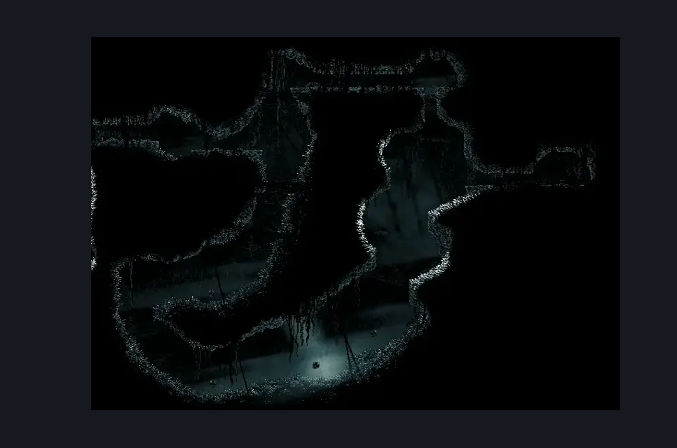
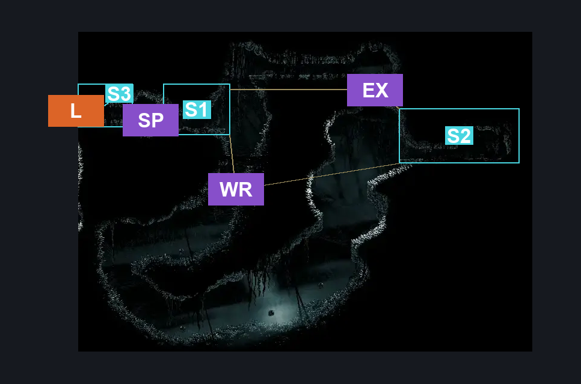
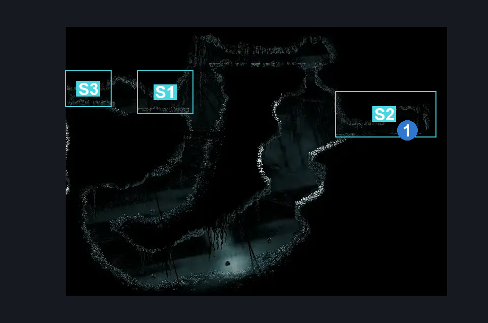

# Arcane Egg Room (Abyss_04)

**Game ID:** Abyss_04

**Contributors:** Pyxl

## Subrooms

| No. | Subroom | Annotated |
| --- | --- | --- |
| S1 | Start | ✓ |
| S2 | End | ✓ |
| S3 | Entrance | ✓ |

## Room Transitions

| Alias | Name | From subroom | Destination | Destination alias | Requirements | TODO | Verification | Annotated | Notes |
| --- | --- | --- | --- | --- | --- | --- | --- | --- | --- |
| L | left1 | Entrance | [Abyss Tall Room (Abyss_01)](abyss-tall-room.md) | MR | None |  | Verified | ✓ |  |

## Subroom Connections

| Alias | Name | Source | Destination | Requirements | TODO | Verification | Annotated | Notes |
| --- | --- | --- | --- | --- | --- | --- | --- | --- |
| WR | Whole Room | Start | End | Clawline AND Cling Grip AND Faydown Cloak |  | Verified | ✓ |  |
| EX | Exit | End | Start | ( Cling Grip AND ( Faydown Cloak OR Clawline ) ) |  | Verified | ✓ |  |
| EX | Exit | Start | End | Silk Soar AND ( Proficient Movement AND spike pogo ) |  | Verified | ✓ |  |
| SP | Spikes | Entrance | Start | Sprint OR Dash OR Clawline OR Sharpdart OR Drifters Cloak OR Faydown Cloak |  | Verified | ✓ |  |
| SP | Spikes | Start | Entrance | None |  | Verified | ✓ |  |

## Check Locations

| No. | Check | Subroom | Requirements | TODO | Verification | Location Type | Annotated | Notes |
| --- | --- | --- | --- | --- | --- | --- | --- | --- |
| 1 | Arcane Egg | End | None |  | Verified | collectible | ✓ |  |

## Room Images

### Scene

### Connections

### Checks

