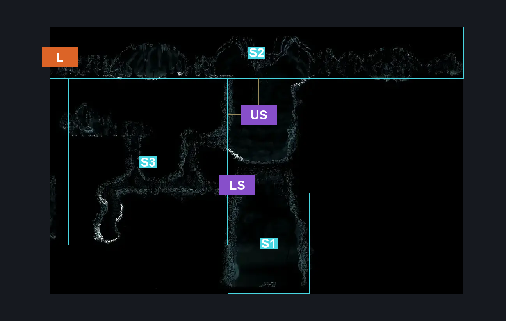
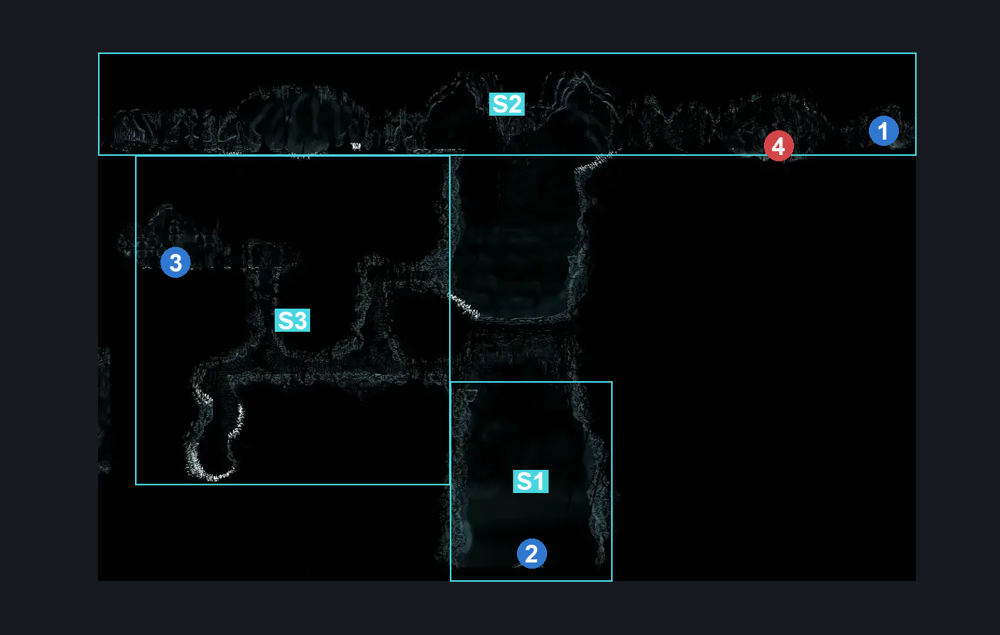
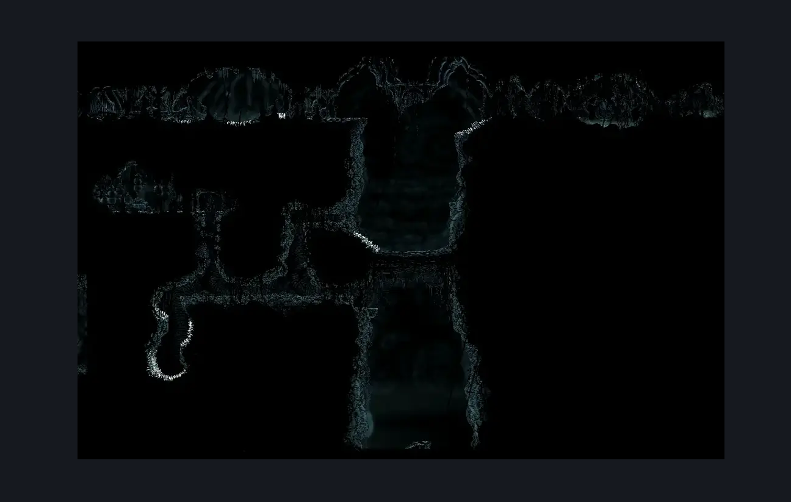

# Weavenest Absolom (Abyss_08)

**Game ID:** Abyss_08

**Contributors:** Pyxl

## Subrooms

| No. | Subroom | Annotated |
| --- | --- | --- |
| S1 | The Void | ✓ |
| S2 | Entrance Zone | ✓ |
| S3 | Passageways | ✓ |

## Room Transitions

| Alias | Name | From subroom | Destination | Destination alias | Requirements | TODO | Verification | Annotated | Notes |
| --- | --- | --- | --- | --- | --- | --- | --- | --- | --- |
| L | left1 | Entrance Zone | [Abyss Lower Big Room (Abyss_05)](abyss-lower-big-room.md) | R | Needolin |  | Verified | ✓ |  |

## Subroom Connections

| Alias | Name | Source | Destination | Requirements | TODO | Verification | Annotated | Notes |
| --- | --- | --- | --- | --- | --- | --- | --- | --- |
| US | Upper Shaft | Entrance Zone | Passageways | None |  | Verified | ✓ |  |
| US | Upper Shaft | Passageways | Entrance Zone | Silk Soar |  | Verified | ✓ |  |
| LS | Lower Shaft | Passageways | The Void | None |  | Verified | ✓ |  |
| LS | Lower Shaft | The Void | Passageways | Silk Soar AND ( Faydown Cloak OR Drifters Cloak OR Dash OR Clawline OR Sharpdart ) |  | Verified | ✓ |  |

## Check Locations

| No. | Check | Subroom | Requirements | TODO | Verification | Location Type | Annotated | Notes |
| --- | --- | --- | --- | --- | --- | --- | --- | --- |
| 1 | Farsight | Entrance Zone | Silk Soar OR Clawline OR ( Faydown Cloak AND ( Dash OR Drifters Cloak ) ) |  | Verified | collectible | ✓ |  |
| 2 | Silk Soar | The Void | None |  | Verified | collectible | ✓ |  |
| 3 | Journal Entry: Void Tentrils | Passageways | Silk Soar OR ( Faydown Cloak AND ( Cling grip OR Scuttlebrace ) ) |  | Verified | lore | ✓ |  |

## Room Images

### Connections

### Checks

### Scene

