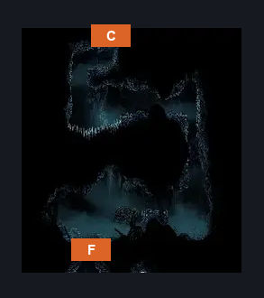
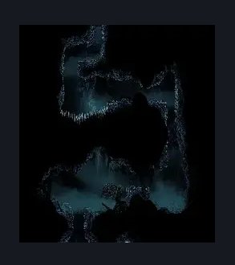

# ACT3 Connection To GMS (Cradle_01_Destroyed)

**Game ID:** Cradle_01_Destroyed

**Contributors:** Pyxl

## Subrooms

No subrooms defined.

## Room Transitions

| Alias | Name | From subroom | Destination | Destination alias | Requirements | TODO | Verification | Annotated | Notes |
| --- | --- | --- | --- | --- | --- | --- | --- | --- | --- |
| F | bot1 |  | [ACT3 Lace2 Arena (Song_Tower_Destroyed)](act3-lace2-arena.md) | C | ~None |  | Verified | ✓ |  |
| C | top1 |  | [ACT3 GMS Arena (Cradle_03_Destroyed)](act3-gms-arena.md) | F | ( Cling Grip OR Scuttlebrace ) AND ( Silk Soar OR Faydown Cloak ) |  | Verified | ✓ |  |

## Subroom Connections

No subroom connections defined.

## Check Locations

No check locations defined.

## Room Images

### Scene

### Connections

### Checks

