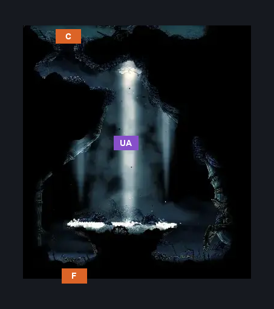
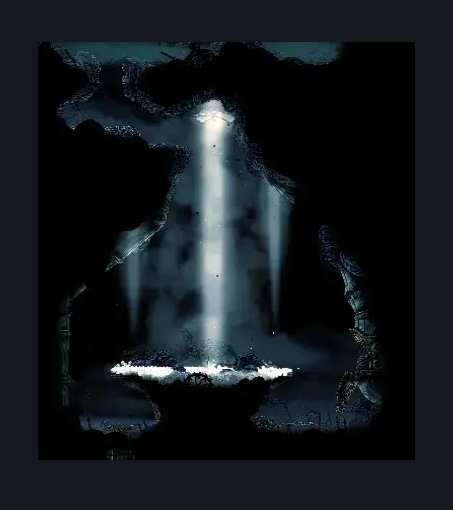

# ACT3 Lace2 Arena (Song_Tower_Destroyed)

**Game ID:** Song_Tower_Destroyed

**Contributors:** Pyxl

## Subrooms

| No. | Subroom | Annotated |
| --- | --- | --- |
| S1 | Surface Path |  |
| S2 | Flower Bed |  |

## Room Transitions

| Alias | Name | From subroom | Destination | Destination alias | Requirements | TODO | Verification | Annotated | Notes |
| --- | --- | --- | --- | --- | --- | --- | --- | --- | --- |
| F | bot1 | Flower Bed | [Cogwork Core Architect's Melody (Act 3) (Cog_09_Destroyed)](../cogwork-core/cogwork-core-architect-s-melody-act-3.md) | T | None |  | Verified | ✓ |  |
| C | top1 | Surface Path | [ACT3 Connection To GMS (Cradle_01_Destroyed)](act3-connection-to-gms.md) | F | None |  | Verified | ✓ |  |

## Subroom Connections

| Alias | Name | Source | Destination | Requirements | TODO | Verification | Annotated | Notes |
| --- | --- | --- | --- | --- | --- | --- | --- | --- |
| UA | Up And Away | Flower Bed | Surface Path | Silk Soar |  | Verified | ✓ |  |
| UA | Up And Away | Surface Path | Flower Bed | None |  | Verified | ✓ |  |

## Check Locations

No check locations defined.

## Room Images

### Connections

### Checks

### Scene

