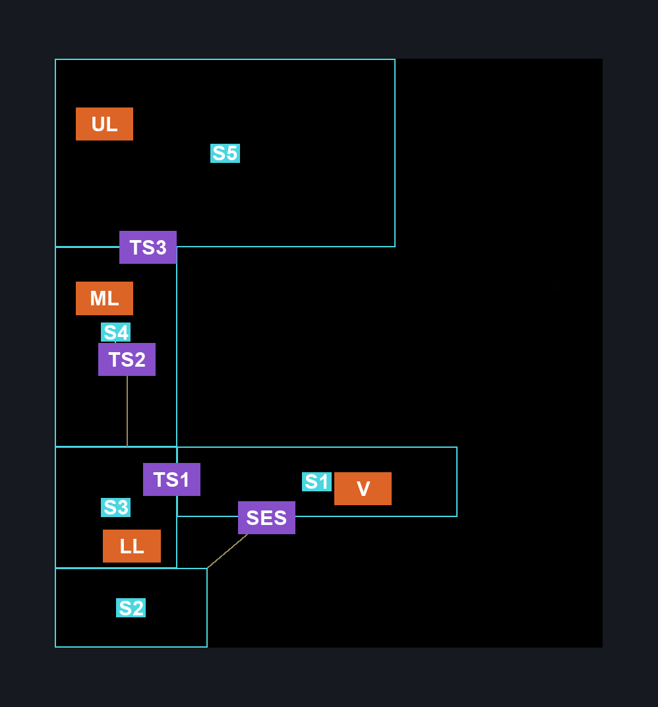
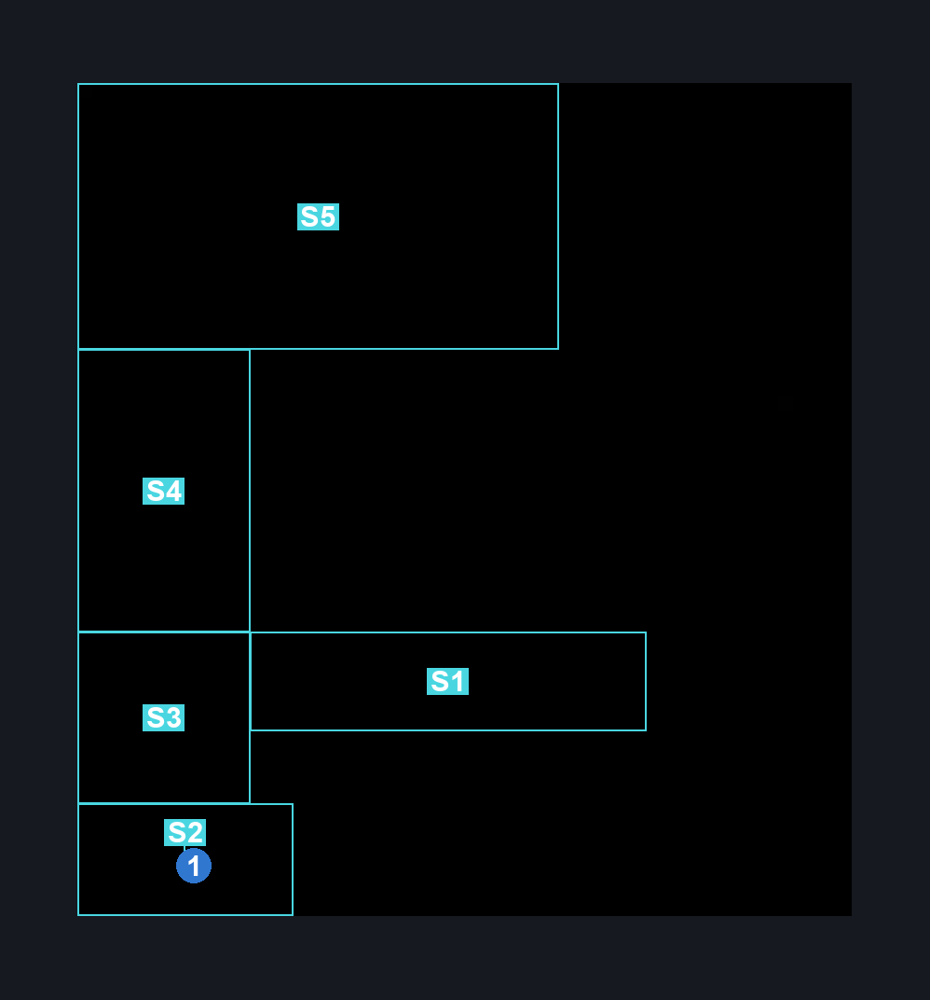

# Terminus Ventrica (Tube_Hub)

**Game ID:** Tube_Hub

**Contributors:** Pyxl

## Subrooms

| No. | Subroom | Annotated |
| --- | --- | --- |
| S1 | Ventricas | ✓ |
| S2 | Silkeater Room | ✓ |
| S3 | Lower Shaft | ✓ |
| S4 | Central Shaft | ✓ |
| S5 | Upper Shaft | ✓ |

## Room Transitions

| Alias | Name | From subroom | Destination | Destination alias | Requirements | TODO | Verification | Annotated | Notes |
| --- | --- | --- | --- | --- | --- | --- | --- | --- | --- |
| LL | left1 | Lower Shaft | [Lace 2 Fight (Song_Tower_01)](lace-2-fight.md) | R | ACT 2 |  | Verified | ✓ |  |
| ML | left4 | Central Shaft | [Act2 Cradle Connector Hallway (Cradle_01)](act2-cradle-connector-hallway.md) | R | ACT 2 |  | Verified | ✓ |  |
| UL | left3 | Upper Shaft | [ACT2 GMS Arena (Cradle_03)](act2-gms-arena.md) | R | ACT 2 |  | Verified | ✓ |  |
| V | door_tubeEnter | Ventricas | [Ventrica Menu](../fast-travel/ventrica-menu.md) | T | unlock ventrica terminus |  | Verified | ✓ |  |

## Subroom Connections

| Alias | Name | Source | Destination | Requirements | TODO | Verification | Annotated | Notes |
| --- | --- | --- | --- | --- | --- | --- | --- | --- |
| SES | Silk Eater Shaft | Silkeater Room | Ventricas | prereq Breakable floor terminus AND ( Cling Grip OR Scuttlebrace ) |  | Verified | ✓ | Potentially possible with silk soar if you come during act 3 |
| SES | Silk Eater Shaft | Ventricas | Silkeater Room | prereq Breakable floor terminus |  | Verified | ✓ |  |
| TS1 | Tall Shaft1 | Ventricas | Lower Shaft | prereq Terminus OWW |  | Verified | ✓ |  |
| TS1 | Tall Shaft1 | Lower Shaft | Ventricas | prereq Terminus OWW AND ( Scuttlebrace OR Cling Grip OR Silk Soar ) |  | Verified | ✓ |  |
| TS2 | Tall Shaft2 | Lower Shaft | Central Shaft | Scuttlebrace OR Cling Grip OR Silk Soar |  | Verified | ✓ |  |
| TS2 | Tall Shaft2 | Central Shaft | Lower Shaft | None |  | Verified | ✓ |  |
| TS3 | Tall Shaft3 | Central Shaft | Upper Shaft | prereq Terminus Upper Shaft AND ( Scuttlebrace OR Cling Grip OR Silk Soar ) |  | Verified | ✓ |  |
| TS3 | Tall Shaft3 | Upper Shaft | Central Shaft | prereq Terminus Upper Shaft |  | Verified | ✓ |  |

## Check Locations

| No. | Check | Subroom | Requirements | TODO | Verification | Location Type | Annotated | Notes |
| --- | --- | --- | --- | --- | --- | --- | --- | --- |
| 1 | Silkeate: Terminus | Silkeater Room | None |  | Verified | collectible | ✓ |  |
| 2 | Breakable Floor terminus | Ventricas | None |  | Verified | blockade |  |  |
| 3 | Terminus OWW | Lower Shaft | None |  | Verified | blockade |  |  |
| 4 | Terminus Upper Shaft | Upper Shaft | None |  | Verified | switch |  |  |
| 5 | Ventrica Terminus | Ventricas | None |  | Verified | travel |  | Always owned |

## Notes

I entered this during act 3 and got the same scene dump, dont believe they count as differant rooms also cannot find the area on the map

## Room Images

### Scene

### Connections

### Checks

