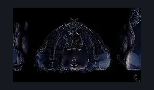

# The Marrow Bellshrine (Bellshrine)

**Game ID:** Bellshrine

**Contributors:** herounit

## Subrooms

No subrooms defined.

## Room Transitions

| Alias | Name | From subroom | Destination | Destination alias | Requirements | TODO | Verification | Annotated | Notes |
| --- | --- | --- | --- | --- | --- | --- | --- | --- | --- |
| L | left |  | [The Marrow Bellway (Bone_05)](the-marrow-bellway.md) | R | none |  | Verified |  |  |
| R | right |  | [The Marrow Shaft (Bone_03)](the-marrow-shaft.md) | UL | ( bellshrinesanity off AND activate bellshrine switch )  OR ( bellshrinesanity on AND have bell the marrow ) |  | Verified |  | requirement for inner and outer gate must be maintained in sync |

## Subroom Connections

No subroom connections defined.

## Check Locations

| No. | Check | Subroom | Requirements | TODO | Verification | Location Type | Annotated | Notes |
| --- | --- | --- | --- | --- | --- | --- | --- | --- |
| 1 | bellshrine switch |  | flip switch down |  | Verified | switch |  | this opens the right exit |
| 2 | bench |  | activate bellshrine switch |  | Verified | bench |  |  |
| 3 | bell the marrow |  | activate bellshrine switch |  | Verified | collectible |  |  |

## Room Images

### Scene

### Connections

### Checks

