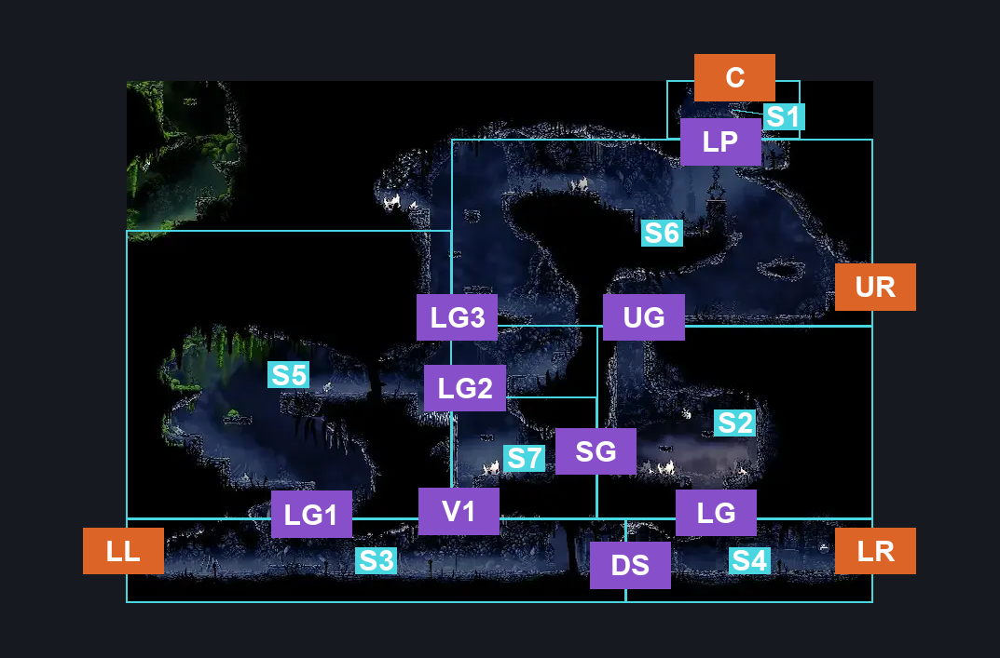
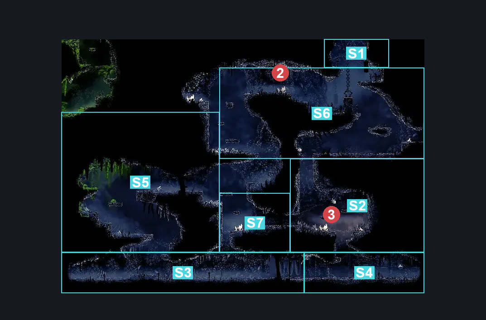
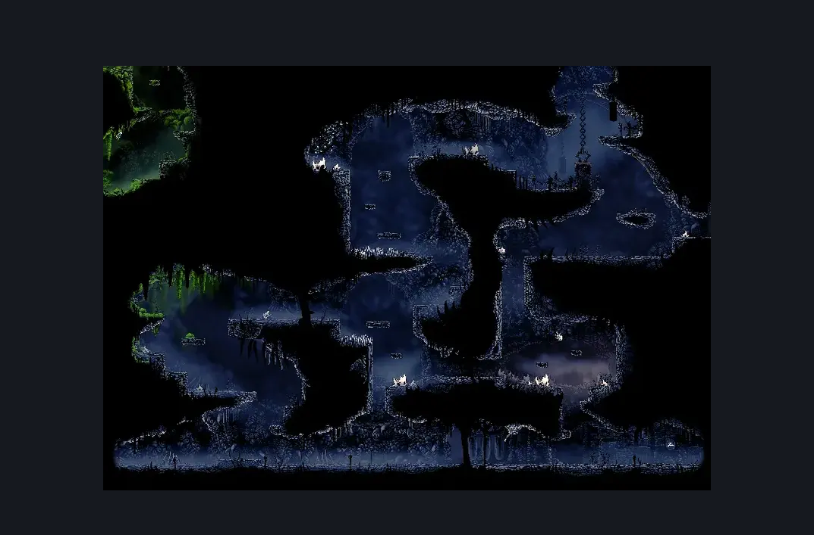

# The Marrow Entrance (Bone_01)

**Game ID:** Bone_01

**Contributors:** herounit

## Subrooms

| No. | Subroom | Annotated |
| --- | --- | --- |
| S1 | ceiling exit | ✓ |
| S2 | gauntlet arena | ✓ |
| S3 | passage left | ✓ |
| S4 | passage right | ✓ |
| S5 | middle left | ✓ |
| S6 | above gauntlet | ✓ |
| S7 | left of gauntlet | ✓ |

## Room Transitions

| Alias | Name | From subroom | Destination | Destination alias | Requirements | TODO | Verification | Annotated | Notes |
| --- | --- | --- | --- | --- | --- | --- | --- | --- | --- |
| LL | lower left | passage left | [Bone Bottom Town (Bonetown)](../bone-bottom/bone-bottom-town.md) | LR | none |  | Verified | ✓ |  |
| LR | lower right | passage right | [The Marrow Bell Bench (Bone_01c)](the-marrow-bell-bench.md) | LL | none |  | Verified | ✓ |  |
| UR | upper right | above gauntlet | [The Marrow Bell Bench (Bone_01c)](the-marrow-bell-bench.md) | UL | break wall right |  | Verified | ✓ |  |
| C | ceiling | ceiling exit | [The Marrow Map Shop (Bone_04)](the-marrow-map-shop.md) | F | none |  | Verified | ✓ |  |

## Subroom Connections

| Alias | Name | Source | Destination | Requirements | TODO | Verification | Annotated | Notes |
| --- | --- | --- | --- | --- | --- | --- | --- | --- |
| DS | door switch | passage left | passage right | activate sherma door switch |  | Verified | ✓ |  |
| DS | door switch | passage right | passage left | activate sherma door switch |  | Verified | ✓ |  |
| UG | upper gauntlet entrance | above gauntlet | gauntlet arena | none (starts gauntlet) |  | Verified | ✓ |  |
| UG | upper gauntlet entrance | gauntlet arena | above gauntlet | defeat gauntlet fight AND ( silk soar  OR cling grip OR scuttlebrace ) |  | Verified | ✓ |  |
| SG | side gauntlet entrance | left of gauntlet | gauntlet arena | defeat gauntlet fight |  | Verified | ✓ |  |
| SG | side gauntlet entrance | gauntlet arena | left of gauntlet | defeat gauntlet fight |  | Verified | ✓ |  |
| LG | lower gauntlet entrance | gauntlet arena | passage right | defeat gauntlet fight |  | Verified | ✓ |  |
| LG | lower gauntlet entrance | passage right | gauntlet arena | defeat gauntlet fight AND ( ledge grab OR faydown OR cling grip OR silk soar ) |  | Verified | ✓ |  |
| LP | lowered platform | above gauntlet | ceiling exit | silk soar  OR ( faydown cloak AND ( run OR ledge grab OR cling grip ) ) OR ( run AND ( clawline OR sharpdart ) AND ( ledge grab OR cling grip ) ) OR ( activate lower platform switch other room IN the marrow map shop AND ( ledge grab OR cling grip OR faydown ) ) |  | Verified | ✓ | The platform lowering switch has the possibility of making this non-monotonic because it *seems* to require ledge grab to hop over the lowered platform. Probably not really an issue. |
| LP | lowered platform | ceiling exit | above gauntlet | none (falling) |  | Verified | ✓ |  |
| LG1 | ledge grab 1 | passage left | middle left | ledge grab OR cling grip OR faydown cloak OR silk soar |  | Verified | ✓ |  |
| LG1 | ledge grab 1 | middle left | passage left | none (falling) |  | Verified | ✓ |  |
| LG2 | ledge grab 2 | left of gauntlet | middle left | ledge grab OR cling grip OR faydown cloak OR silk soar OR scuttlebrace |  | Verified | ✓ |  |
| LG2 | ledge grab 2 | middle left | left of gauntlet | none (falling) |  | Verified | ✓ |  |
| LG3 | ledge grab 3 | middle left | above gauntlet | ledge grab OR cling grip OR faydown cloak OR silk soar OR scuttlebrace |  | Verified | ✓ |  |
| LG3 | ledge grab 3 | above gauntlet | middle left | none (falling) |  | Verified | ✓ |  |
| V1 | vertical 1 | passage left | left of gauntlet | silk soar |  | Verified | ✓ |  |
| V1 | vertical 1 | left of gauntlet | passage left | none (falling) |  | Verified | ✓ |  |

## Check Locations

| No. | Check | Subroom | Requirements | TODO | Verification | Location Type | Annotated | Notes |
| --- | --- | --- | --- | --- | --- | --- | --- | --- |
| 1 | the marrow shell shard cache 1 | above gauntlet | none |  | Verified | collectible |  |  |
| 2 | volatile flintbeetle 1 | above gauntlet | complete THE volatile flintbeetles wish promised |  | Verified | miniboss | ✓ | stable position |
| 3 | gauntlet fight | gauntlet arena | none |  | Verified | gauntlet | ✓ |  |
| 4 | sherma door switch | passage right | flip switch up |  | Verified | switch |  |  |
| 5 | the marrow rosary cache 1 | passage right | none |  | Verified | collectible |  |  |
| 6 | the marrow rosary cache 2 | passage right | none |  | Verified | collectible |  |  |

## Room Images

### Connections

### Checks

### Scene

