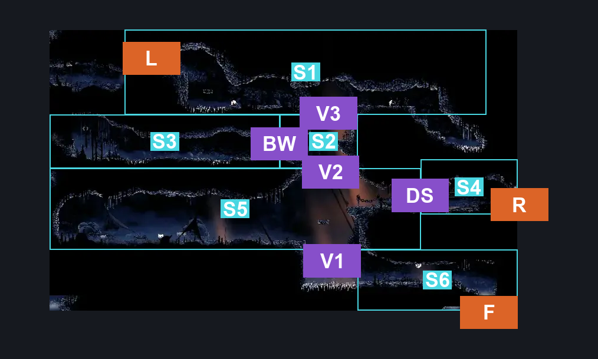
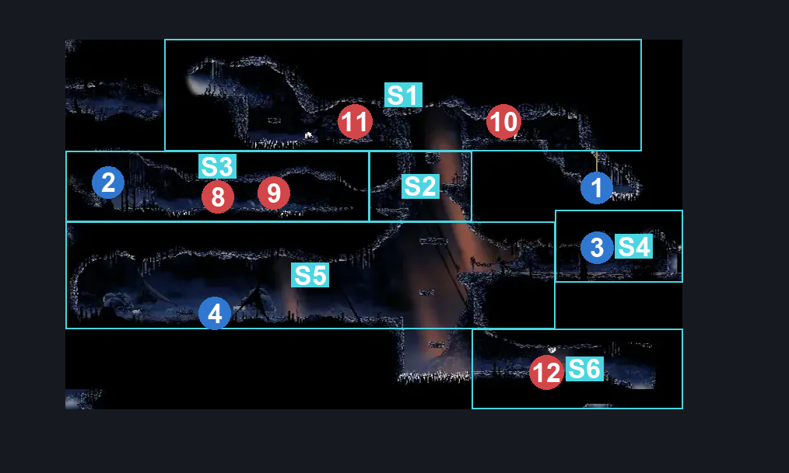
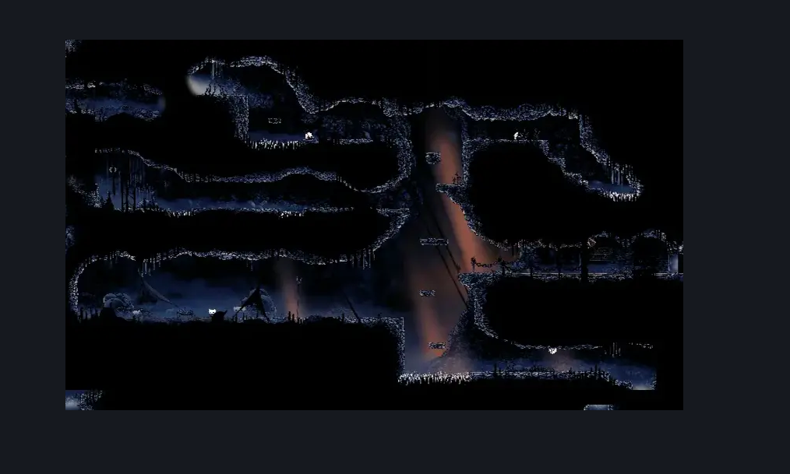

# The Marrow Flea Caravan (Bone_10)

**Game ID:** Bone_10

**Contributors:** herounit

## Subrooms

| No. | Subroom | Annotated |
| --- | --- | --- |
| S1 | top floor | ✓ |
| S2 | before breakable wall | ✓ |
| S3 | behind breakable wall | ✓ |
| S4 | behind metal gate | ✓ |
| S5 | flea floor | ✓ |
| S6 | ground floor | ✓ |

## Room Transitions

| Alias | Name | From subroom | Destination | Destination alias | Requirements | TODO | Verification | Annotated | Notes |
| --- | --- | --- | --- | --- | --- | --- | --- | --- | --- |
| L | left | top floor | [The Marrow Shaft (Bone_03)](the-marrow-shaft.md) | LR | none |  | Verified | ✓ |  |
| R | right | behind metal gate | [The Marrow Skull Tyrant Arena (Bone_15)](the-marrow-skull-tyrant-arena.md) | L | none |  | Verified | ✓ |  |
| F | floor | ground floor | [The Marrow Lava Intro (Bone_02)](the-marrow-lava-intro.md) | RC | none |  | Verified | ✓ |  |

## Subroom Connections

| Alias | Name | Source | Destination | Requirements | TODO | Verification | Annotated | Notes |
| --- | --- | --- | --- | --- | --- | --- | --- | --- |
| DS | door switch | flea floor | behind metal gate | activate door switch |  | Verified | ✓ |  |
| DS | door switch | behind metal gate | flea floor | activate door switch |  | Verified | ✓ |  |
| V1 | vertical 1 | ground floor | flea floor | ledge grab OR easy shaman pogo OR faydown OR cling grip OR scuttlebrace OR silk soar |  | Verified | ✓ |  |
| V1 | vertical 1 | flea floor | ground floor | none (falling) |  | Verified | ✓ |  |
| BW | break wall | before breakable wall | behind breakable wall | break wall left |  | Verified | ✓ |  |
| BW | break wall | behind breakable wall | before breakable wall | break wall right |  | Verified | ✓ |  |
| V2 | vertical 2 | flea floor | before breakable wall | ledge grab OR faydown OR cling grip OR silk soar |  | Verified | ✓ |  |
| V2 | vertical 2 | before breakable wall | flea floor | none (falling) |  | Verified | ✓ |  |
| V3 | vertical 3 | before breakable wall | top floor | ledge grab OR easy shaman pogo OR faydown OR cling grip OR scuttlebrace OR silk soar |  | Verified | ✓ |  |
| V3 | vertical 3 | top floor | before breakable wall | none (falling) |  | Verified | ✓ |  |

## Check Locations

| No. | Check | Subroom | Requirements | TODO | Verification | Location Type | Annotated | Notes |
| --- | --- | --- | --- | --- | --- | --- | --- | --- |
| 1 | the marrow flea caravan passage frayed rosary string | top floor | none |  | Verified | collectible | ✓ |  |
| 2 | the marrow flea caravan rosary dish | behind breakable wall | none |  | Verified | collectible | ✓ |  |
| 3 | door switch | behind metal gate | flip switch up |  | Verified | switch | ✓ |  |
| 4 | survivors camps supplies wish granted | flea floor | complete THE survivors camp supplies wish promised |  | Verified | event | ✓ |  |
| 5 | the lost fleas wish promised | flea floor | none |  | Verified | event |  | wish can be started here or at the bone bottom wish wall |
| 6 | the lost fleas wish granted | flea floor | ( act 1 OR act 2 )  AND complete the lost fleas wish promised AND fleas 5 |  | Verified | event |  | grants caravan invite |
| 7 | flea caravan move to greymoor | flea floor | complete the lost fleas wish granted |  | Verified | event |  |  |

## Room Images

### Connections

### Checks

### Scene

