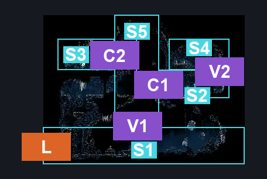
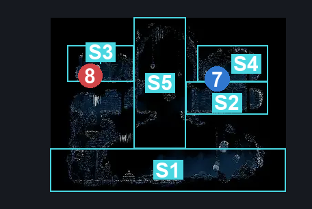

# The Marrow Jail (Bone_12)

**Game ID:** Bone_12

**Contributors:** herounit

## Subrooms

| No. | Subroom | Annotated |
| --- | --- | --- |
| S1 | ground floor | ✓ |
| S2 | grindle cell | ✓ |
| S3 | other cell | ✓ |
| S4 | above grindle cell | ✓ |
| S5 | upper platforms | ✓ |

## Room Transitions

| Alias | Name | From subroom | Destination | Destination alias | Requirements | TODO | Verification | Annotated | Notes |
| --- | --- | --- | --- | --- | --- | --- | --- | --- | --- |
| L | left | ground floor | [The Marrow Jail Pathway (Bone_08)](the-marrow-jail-pathway.md) | JD | none |  | Verified | ✓ |  |

## Subroom Connections

| Alias | Name | Source | Destination | Requirements | TODO | Verification | Annotated | Notes |
| --- | --- | --- | --- | --- | --- | --- | --- | --- |
| V1 | vertical 1 | ground floor | upper platforms | ledge grab OR cling grip OR scuttlebrace OR faydown OR silk soar |  | Verified | ✓ |  |
| V1 | vertical 1 | upper platforms | ground floor | none (falling) |  | Verified | ✓ |  |
| C1 | open cell 1 | upper platforms | grindle cell | break wall right |  | Verified | ✓ |  |
| C1 | open cell 1 | grindle cell | upper platforms | break wall left |  | Verified | ✓ |  |
| C2 | open cell 2 | upper platforms | other cell | break wall left |  | Verified | ✓ |  |
| C2 | open cell 2 | other cell | upper platforms | break wall right |  | Verified | ✓ |  |
| V2 | vertical 2 | grindle cell | above grindle cell | ledge grab OR cling grip OR faydown OR silk soar |  | Verified | ✓ |  |
| V2 | vertical 2 | above grindle cell | grindle cell | none (falling) |  | Verified | ✓ |  |

## Check Locations

| No. | Check | Subroom | Requirements | TODO | Verification | Location Type | Annotated | Notes |
| --- | --- | --- | --- | --- | --- | --- | --- | --- |
| 1 | bench | ground floor | none |  | Verified | bench |  |  |
| 2 | pin minigame 1 | ground floor | defeat THE boss widow AND spend 25 rosaries AND ( Act 1 OR Act 2 ) |  | Verified | event |  | requirements per the wiki - not sure if you need the straight pin to start it or not |
| 3 | pin minigame 2 | ground floor | complete pin minigame 1 AND spend 25 rosaries AND ( Act 1 OR Act 2 ) |  | Verified | event |  | requirements per the wiki |
| 4 | pin minigame 3 | ground floor | complete pin minigame 2 AND spend 25 rosaries AND ( Act 1 OR Act 2 ) |  | Verified | event |  | requirements per the wiki |
| 5 | progressive tool pouch | ground floor | complete pin minigame 1 OR Act 3 |  | Verified | collectible |  | tool pouch will be available for free in act 3 if not already collected |
| 6 | heavy rosary necklace | ground floor | complete pin minigame 2 |  | Verified | collectible |  |  |
| 7 | straight pin | above grindle cell | none |  | Verified | collectible | ✓ |  |

## Room Images

### Connections

### Checks

### Scene

