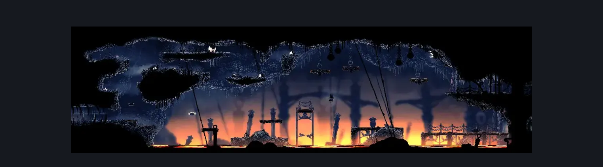
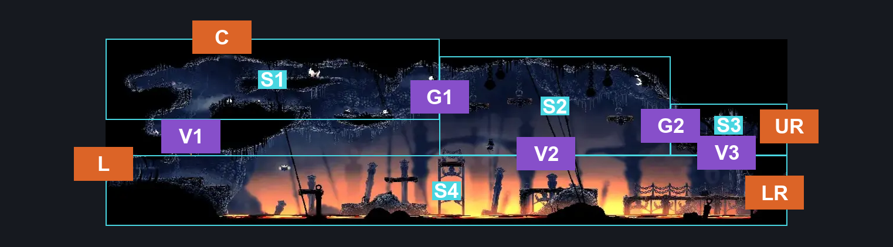
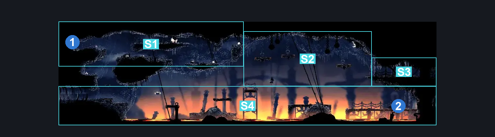

# The Marrow Lava Docks (Bone_09)

**Game ID:** Bone_09

**Contributors:** herounit

## Subrooms

| No. | Subroom | Annotated |
| --- | --- | --- |
| S1 | upper left platforms | ✓ |
| S2 | elevated platforms | ✓ |
| S3 | upper right exit | ✓ |
| S4 | ground floor | ✓ |

## Room Transitions

| Alias | Name | From subroom | Destination | Destination alias | Requirements | TODO | Verification | Annotated | Notes |
| --- | --- | --- | --- | --- | --- | --- | --- | --- | --- |
| C | ceiling | upper left platforms | [The Marrow Jail Pathway (Bone_08)](the-marrow-jail-pathway.md) | F | none |  | Verified | ✓ |  |
| L | left | ground floor | [The Marrow Lava Track (Bone_16)](the-marrow-lava-track.md) | R | none |  | Verified | ✓ |  |
| UR | upper right | upper right exit | [Deep Docks Entrance (Dock_08)](../deep-docks/deep-docks-entrance.md) | UL | none |  | Verified | ✓ |  |
| LR | lower right | ground floor | [Deep Docks Entrance (Dock_08)](../deep-docks/deep-docks-entrance.md) | LL | none |  | Verified | ✓ |  |

## Subroom Connections

| Alias | Name | Source | Destination | Requirements | TODO | Verification | Annotated | Notes |
| --- | --- | --- | --- | --- | --- | --- | --- | --- |
| G1 | gap 1 | upper left platforms | elevated platforms | faydown OR cling grip  OR scuttlebrace |  | Verified | ✓ |  |
| G1 | gap 1 | elevated platforms | upper left platforms | ledge grab OR faydown OR cling grip |  | Verified | ✓ |  |
| G2 | gap 2 | elevated platforms | upper right exit | none (falling) |  | Verified | ✓ |  |
| G2 | gap 2 | upper right exit | elevated platforms | ledge grab OR faydown OR cling grip |  | Verified | ✓ |  |
| V1 | vertical 1 | ground floor | upper left platforms | ledge grab OR easy enemy pogo OR faydown OR cling grip OR scuttlebrace OR silk soar |  | Verified | ✓ |  |
| V1 | vertical 1 | upper left platforms | ground floor | none (falling) |  | Verified | ✓ |  |
| V2 | vertical 2 | ground floor | elevated platforms | silk soar |  | Verified | ✓ |  |
| V2 | vertical 2 | elevated platforms | ground floor | none (falling) |  | Verified | ✓ |  |
| V3 | vertical 3 | ground floor | upper right exit | silk soar |  | Verified | ✓ |  |
| V3 | vertical 3 | upper right exit | ground floor | none (falling) |  | Verified | ✓ |  |

## Check Locations

| No. | Check | Subroom | Requirements | TODO | Verification | Location Type | Annotated | Notes |
| --- | --- | --- | --- | --- | --- | --- | --- | --- |
| 1 | rosary spike | upper left platforms | none |  | Verified | collectible | ✓ |  |
| 2 | Garmond and Zaza Act 3 Meeting The Marrow | ground floor | Act 3 |  | Verified | event | ✓ |  |

## Room Images

### Scene

### Connections

### Checks

