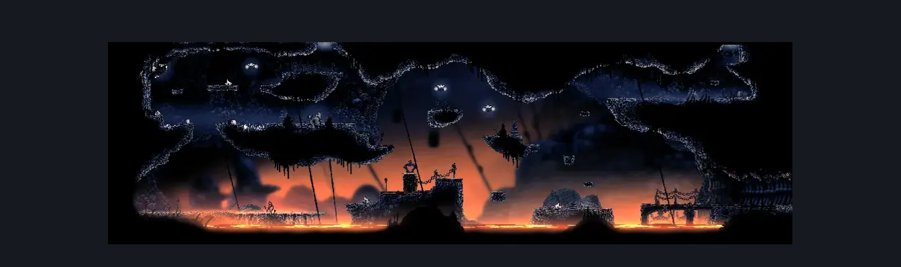
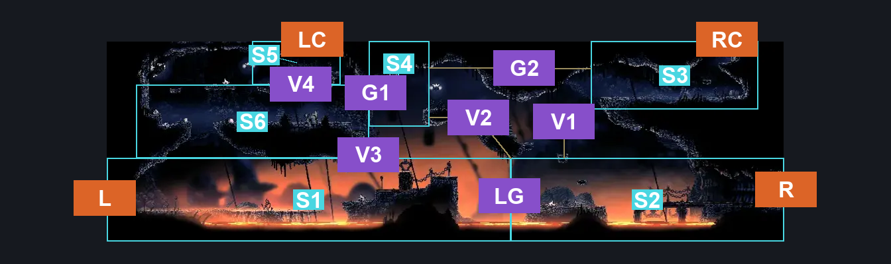
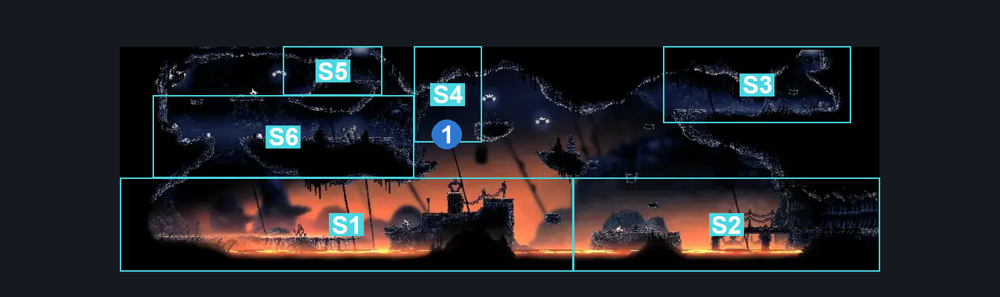

# The Marrow Lava Intro (Bone_02)

**Game ID:** Bone_02

**Contributors:** herounit

## Subrooms

| No. | Subroom | Annotated |
| --- | --- | --- |
| S1 | ground left | ✓ |
| S2 | ground right | ✓ |
| S3 | flea sign platform | ✓ |
| S4 | chain break spot | ✓ |
| S5 | upper left exit | ✓ |
| S6 | left platforms | ✓ |

## Room Transitions

| Alias | Name | From subroom | Destination | Destination alias | Requirements | TODO | Verification | Annotated | Notes |
| --- | --- | --- | --- | --- | --- | --- | --- | --- | --- |
| L | left | ground left | [The Marrow Bell Bench (Bone_01c)](the-marrow-bell-bench.md) | R | none |  | Verified | ✓ |  |
| R | right | ground right | [The Marrow Lava Track (Bone_16)](the-marrow-lava-track.md) | L | none |  | Verified | ✓ |  |
| LC | left ceiling | upper left exit | [The Marrow Shaft (Bone_03)](the-marrow-shaft.md) | F | none |  | Verified | ✓ |  |
| RC | right ceiling | flea sign platform | [The Marrow Flea Caravan (Bone_10)](the-marrow-flea-caravan.md) | F | none |  | Verified | ✓ |  |

## Subroom Connections

| Alias | Name | Source | Destination | Requirements | TODO | Verification | Annotated | Notes |
| --- | --- | --- | --- | --- | --- | --- | --- | --- |
| LG | lava gap | ground left | ground right | none (jump) |  | Verified | ✓ |  |
| LG | lava gap | ground right | ground left | ledge grab OR run OR dash OR drifters OR faydown OR cling grip OR scuttlebrace OR silk soar OR clawline OR sharpdart OR easy shaman pogo OR easy beast pogo |  | Verified | ✓ |  |
| V1 | vertical 1 | ground right | flea sign platform | ledge grab OR faydown OR silk soar OR cling grip OR easy shaman pogo |  | Verified | ✓ |  |
| V1 | vertical 1 | flea sign platform | ground right | none (falling) |  | Verified | ✓ |  |
| V2 | vertical 2 | ground right | chain break spot | ledge grab OR faydown OR silk soar OR cling grip OR easy shaman pogo |  | Verified | ✓ |  |
| V2 | vertical 2 | chain break spot | ground right | none (falling) |  | Verified | ✓ |  |
| V3 | vertical 3 | ground left | left platforms | silk soar OR faydown OR ( after chain drop platform AND ( ledge grab OR cling grip ) ) |  | Verified | ✓ |  |
| V3 | vertical 3 | left platforms | ground left | none (falling) |  | Verified | ✓ |  |
| V4 | vertical 4 | left platforms | upper left exit | silk soar OR ledge grab OR cling grip OR faydown OR easy shaman pogo |  | Verified | ✓ |  |
| V4 | vertical 4 | upper left exit | left platforms | none (falling) |  | Verified | ✓ |  |
| G1 | gap 1 | left platforms | chain break spot | clawline OR sharpdart OR faydown OR ( run AND ( dash OR easy beast pogo ) ) |  | Verified | ✓ |  |
| G1 | gap 1 | chain break spot | left platforms | none (falling) |  | Verified | ✓ |  |
| G2 | gap 2 | chain break spot | flea sign platform | clawline |  | Verified | ✓ | only needs to cover horizontal movement that V2 doesn't. no inverse. |

## Check Locations

| No. | Check | Subroom | Requirements | TODO | Verification | Location Type | Annotated | Notes |
| --- | --- | --- | --- | --- | --- | --- | --- | --- |
| 1 | chain drop platform | chain break spot | none (stand on it) |  | Verified | switch | ✓ |  |

## Notes

no checks

## Room Images

### Scene

### Connections

### Checks

