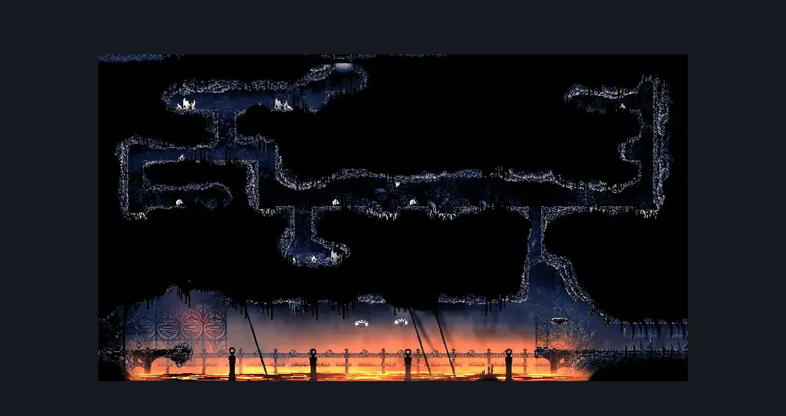
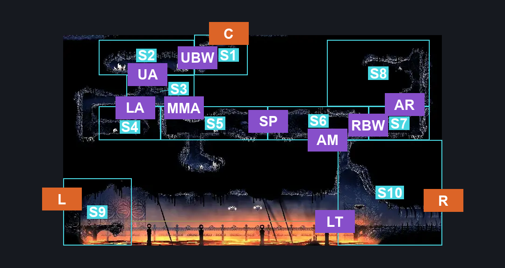
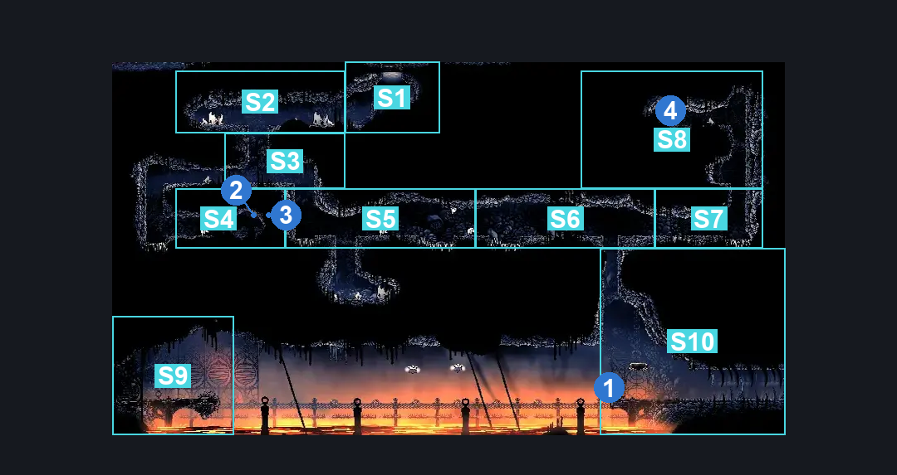

# The Marrow Lava Track (Bone_16)

**Game ID:** Bone_16

**Contributors:** herounit

## Subrooms

| No. | Subroom | Annotated |
| --- | --- | --- |
| S1 | ceiling exit area | ✓ |
| S2 | upper maze left | ✓ |
| S3 | middle maze | ✓ |
| S4 | left alcove | ✓ |
| S5 | lower maze 1 | ✓ |
| S6 | lower maze 2 | ✓ |
| S7 | lower maze 3 | ✓ |
| S8 | right alcove | ✓ |
| S9 | left lava track | ✓ |
| S10 | right lava track | ✓ |

## Room Transitions

| Alias | Name | From subroom | Destination | Destination alias | Requirements | TODO | Verification | Annotated | Notes |
| --- | --- | --- | --- | --- | --- | --- | --- | --- | --- |
| L | left | left lava track | [The Marrow Lava Intro (Bone_02)](the-marrow-lava-intro.md) | R | none |  | Verified | ✓ |  |
| R | right | right lava track | [The Marrow Lava Docks (Bone_09)](the-marrow-lava-docks.md) | L | none |  | Verified | ✓ |  |
| C | ceiling | ceiling exit area | [The Marrow Skull Tyrant Arena (Bone_15)](the-marrow-skull-tyrant-arena.md) | F | none |  | Verified | ✓ |  |

## Subroom Connections

| Alias | Name | Source | Destination | Requirements | TODO | Verification | Annotated | Notes |
| --- | --- | --- | --- | --- | --- | --- | --- | --- |
| LT | lava track | right lava track | left lava track | activate track pressure plate  OR ( clawline x 8 AND easy shaman pogo ) |  | Verified | ✓ | other stalls would work but would be harder |
| LT | lava track | left lava track | right lava track | activate track pressure plate  OR ( clawline x 8 AND easy shaman pogo ) |  | Verified | ✓ | other stalls would work but would be harder |
| AM | ascend to maze | right lava track | lower maze 2 | cling grip  OR silk soar  OR ( scuttlebrace AND ( ledge grab OR faydown cloak OR clawline  ) ) |  | Verified | ✓ |  |
| AM | ascend to maze | lower maze 2 | right lava track | none (falling) |  | Verified | ✓ |  |
| RBW | right break wall | lower maze 2 | lower maze 3 | none (break wall right) |  | Verified | ✓ |  |
| RBW | right break wall | lower maze 3 | lower maze 2 | none (break wall left) |  | Verified | ✓ |  |
| AR | ascend right | lower maze 3 | right alcove | cling grip  OR scuttlebrace  OR ( faydown AND ledge grab ) |  | Verified | ✓ |  |
| AR | ascend right | right alcove | lower maze 3 | spike pogo  OR cling grip  OR faydown  OR dash  OR drifters  OR clawline  OR sharpdart  OR scuttlebrace |  | Verified | ✓ |  |
| MMA | middle maze ascend | lower maze 1 | middle maze | cling grip  OR scuttlebrace  OR ( faydown cloak AND ( ledge grab OR clawline OR easy shaman pogo ) ) |  | Verified | ✓ |  |
| MMA | middle maze ascend | middle maze | lower maze 1 | none (falling) |  | Verified | ✓ |  |
| LA | left alcove access | middle maze | left alcove | none (break wall left) |  | Verified | ✓ |  |
| LA | left alcove access | left alcove | middle maze | cling grip  OR scuttlebrace  OR ( ledge grab AND faydown cloak ) |  | Verified | ✓ |  |
| SP | spike pogo | lower maze 1 | lower maze 2 | ledge grab  OR spike pogo  OR run  OR dash  OR drifter's cloak  OR faydown cloak  OR clawline  OR scuttlebrace  OR sharpdart |  | Verified | ✓ | roof makes it so ledge grab works from left to right  but not the other way |
| SP | spike pogo | lower maze 2 | lower maze 1 | spike pogo  OR run  OR dash  OR drifters  OR faydown  OR clawline  OR scuttlebrace  OR sharpdart |  | Verified | ✓ | possible other stalls might work - lip on ceiling seems to make it impassable with walking jump? |
| UBW | upper break wall | upper maze left | ceiling exit area | none (break wall right) |  | Verified | ✓ |  |
| UBW | upper break wall | ceiling exit area | upper maze left | none (break wall left) |  | Verified | ✓ |  |
| UA | upper ascend | middle maze | upper maze left | silk soar  OR cling grip  OR scuttlebrace  OR ( faydown cloak AND ledge grab ) |  | Verified | ✓ |  |
| UA | upper ascend | upper maze left | middle maze | none (falling) |  | Verified | ✓ |  |

## Check Locations

| No. | Check | Subroom | Requirements | TODO | Verification | Location Type | Annotated | Notes |
| --- | --- | --- | --- | --- | --- | --- | --- | --- |
| 1 | track pressure plate | right lava track | none (stand on it) |  | Verified | switch | ✓ |  |
| 2 | the marrow rosary cache 11 | left alcove | none |  | Verified | collectible | ✓ |  |
| 3 | the marrow rosary cache 12 | left alcove | none |  | Verified | collectible | ✓ |  |
| 4 | the marrow rosary cache 13 | right alcove | none |  | Verified | collectible | ✓ |  |

## Room Images

### Scene

### Connections

### Checks

