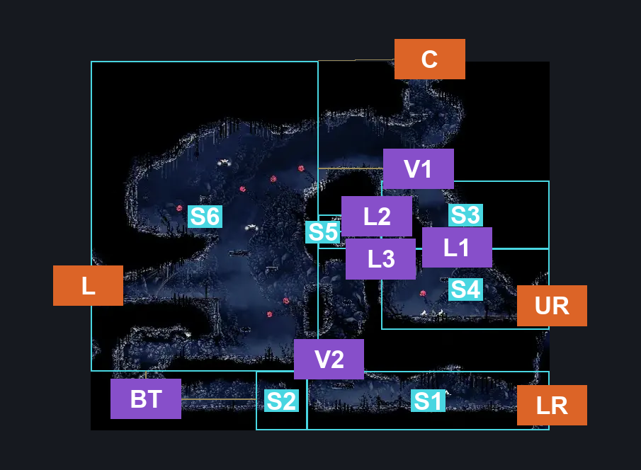
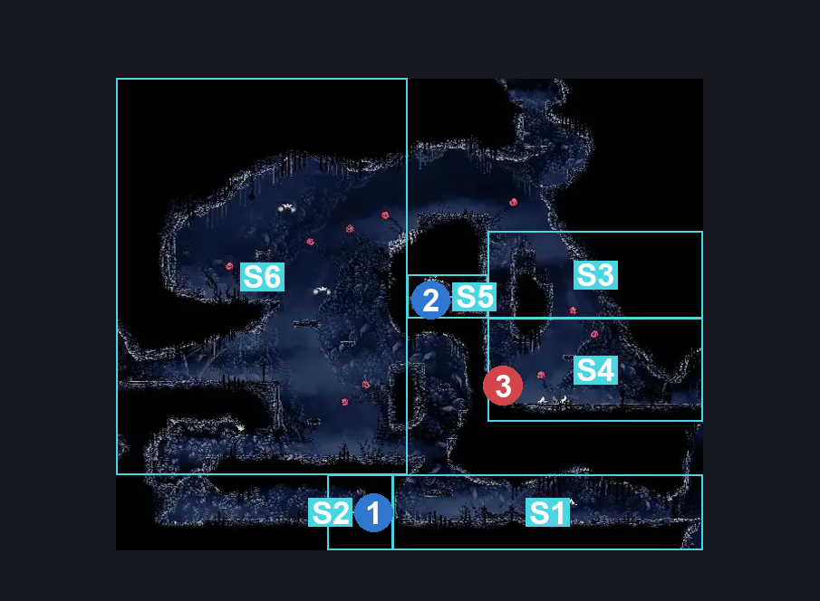
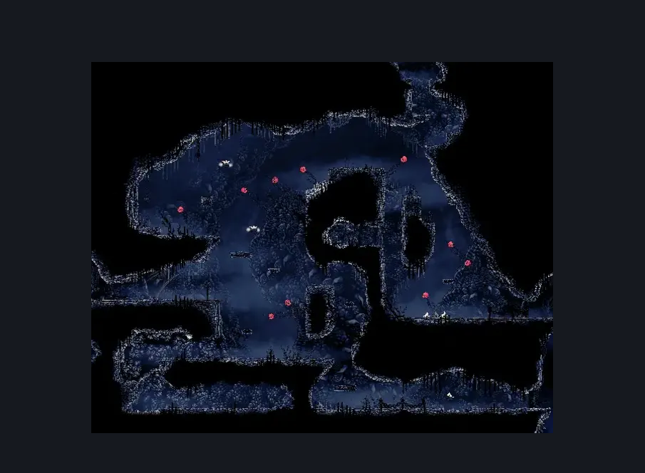

# The Marrow Lower Pogo (Bone_07)

**Game ID:** Bone_07

**Contributors:** herounit

## Subrooms

| No. | Subroom | Annotated |
| --- | --- | --- |
| S1 | lower right exit area | ✓ |
| S2 | craftmetal alcove | ✓ |
| S3 | upper mid right area | ✓ |
| S4 | lower mid right area | ✓ |
| S5 | cache alcove | ✓ |
| S6 | pogo supreme | ✓ |

## Room Transitions

| Alias | Name | From subroom | Destination | Destination alias | Requirements | TODO | Verification | Annotated | Notes |
| --- | --- | --- | --- | --- | --- | --- | --- | --- | --- |
| C | ceiling | pogo supreme | [The Marrow Upper Pogo (Bone_19)](the-marrow-upper-pogo.md) | F | none |  | Verified | ✓ |  |
| L | left | pogo supreme | [The Marrow Mr Burns House (Bone_14)](the-marrow-mr-burns-house.md) | R | none |  | Verified | ✓ |  |
| UR | upper right | lower mid right area | [The Marrow Jail Pathway (Bone_08)](the-marrow-jail-pathway.md) | UL | none |  | Verified | ✓ |  |
| LR | lower right | lower right exit area | [The Marrow Jail Pathway (Bone_08)](the-marrow-jail-pathway.md) | LL | none |  | Verified | ✓ |  |

## Subroom Connections

| Alias | Name | Source | Destination | Requirements | TODO | Verification | Annotated | Notes |
| --- | --- | --- | --- | --- | --- | --- | --- | --- |
| V1 | vertical 1 | upper mid right area | pogo supreme | ledge grab OR easy shaman pogo OR cling grip OR scuttlebrace OR faydown OR silk soar |  | Verified | ✓ |  |
| V1 | vertical 1 | pogo supreme | upper mid right area | none (falling) |  | Verified | ✓ |  |
| L1 | loop part 1 | lower mid right area | upper mid right area | ledge grab OR easy shaman pogo OR cling grip OR scuttlebrace OR faydown OR silk soar |  | Verified | ✓ |  |
| L1 | loop part 1 | upper mid right area | lower mid right area | none (falling) |  | Verified | ✓ |  |
| L2 | loop part 2 | upper mid right area | cache alcove | break blast rock left |  | Verified | ✓ |  |
| L3 | loop part 3 | cache alcove | lower mid right area | none (falling) |  | Verified | ✓ |  |
| BT | blast tunnel | pogo supreme | craftmetal alcove | break blast rock left AND break blast rock right |  | Verified | ✓ |  |
| BT | blast tunnel | craftmetal alcove | pogo supreme | ledge grab OR cling grip OR scuttlebrace OR faydown |  | Verified | ✓ |  |
| V2 | vertical 2 | lower right exit area | pogo supreme | ledge grab OR cling grip OR scuttlebrace OR faydown OR silk soar |  | Verified | ✓ |  |
| V2 | vertical 2 | pogo supreme | lower right exit area | none (falling) |  | Verified | ✓ |  |

## Check Locations

| No. | Check | Subroom | Requirements | TODO | Verification | Location Type | Annotated | Notes |
| --- | --- | --- | --- | --- | --- | --- | --- | --- |
| 1 | the marrow craft metal | craftmetal alcove | attack right |  | Verified | collectible | ✓ |  |
| 2 | the marrow 4 shell shard cache | cache alcove | none |  | Verified | collectible | ✓ |  |
| 3 | volatile flintbeetle 3 | lower mid right area | complete THE volatile flintbeetles wish promised |  | Verified | miniboss | ✓ | this one has a stable position |

## Room Images

### Connections

### Checks

### Scene

